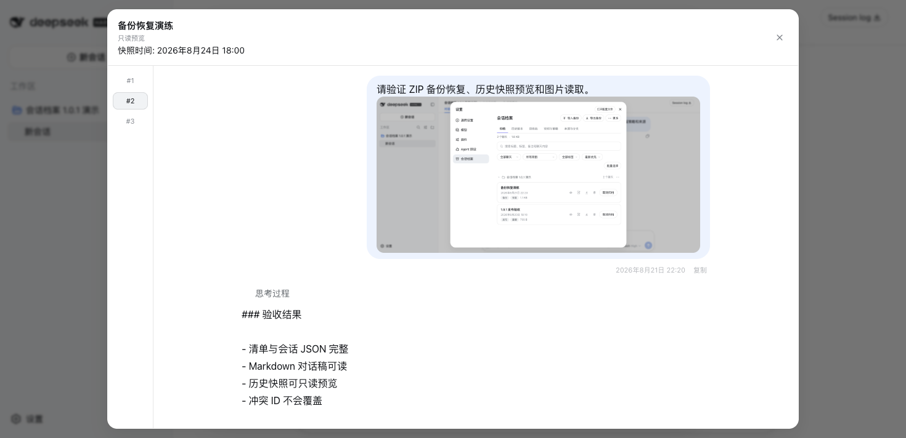
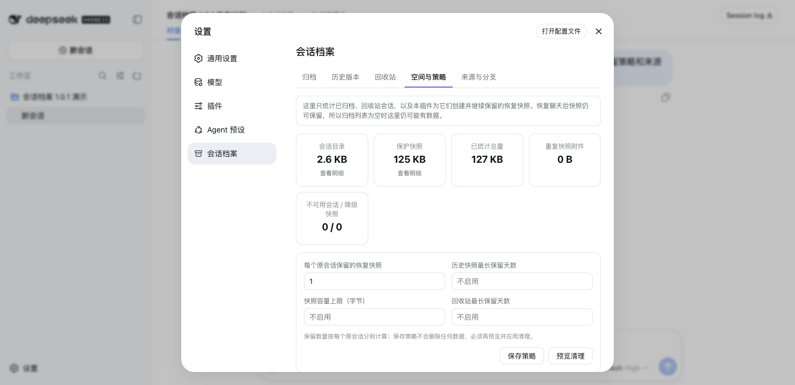
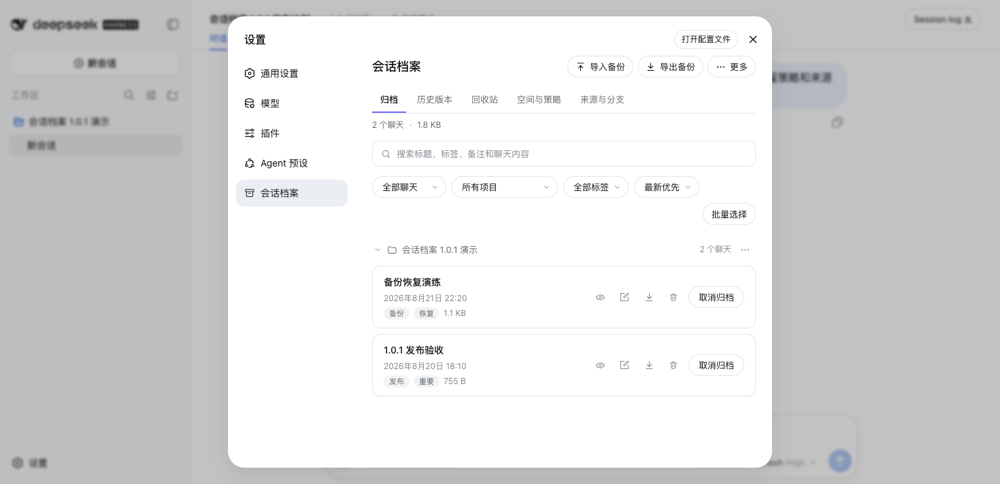
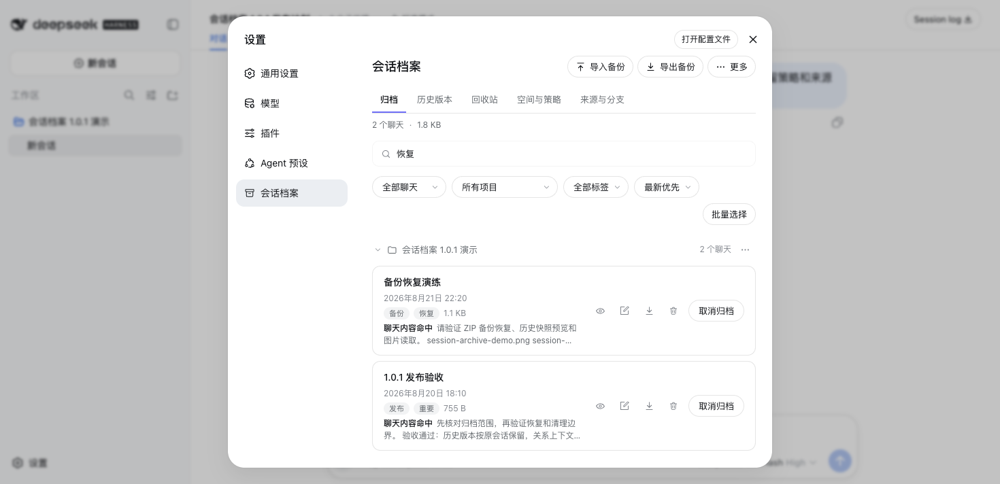
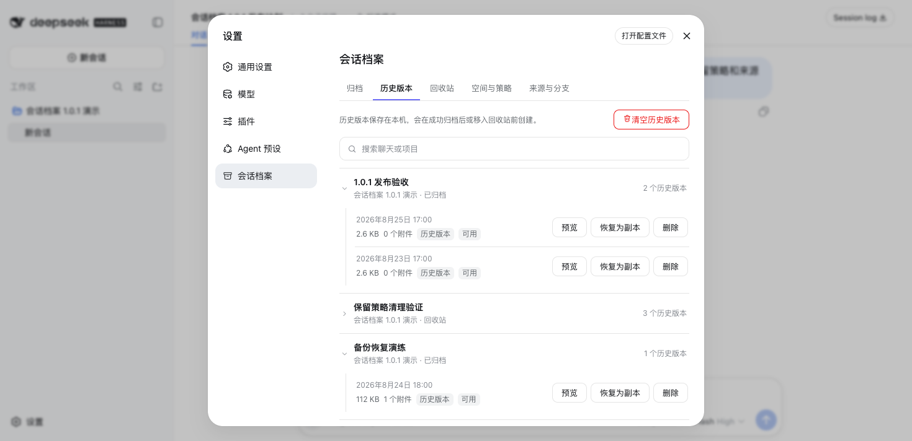
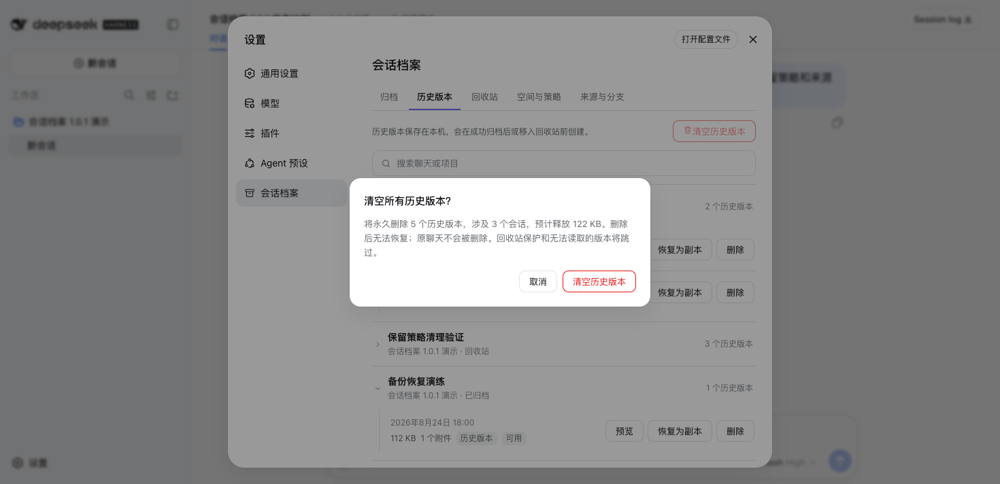
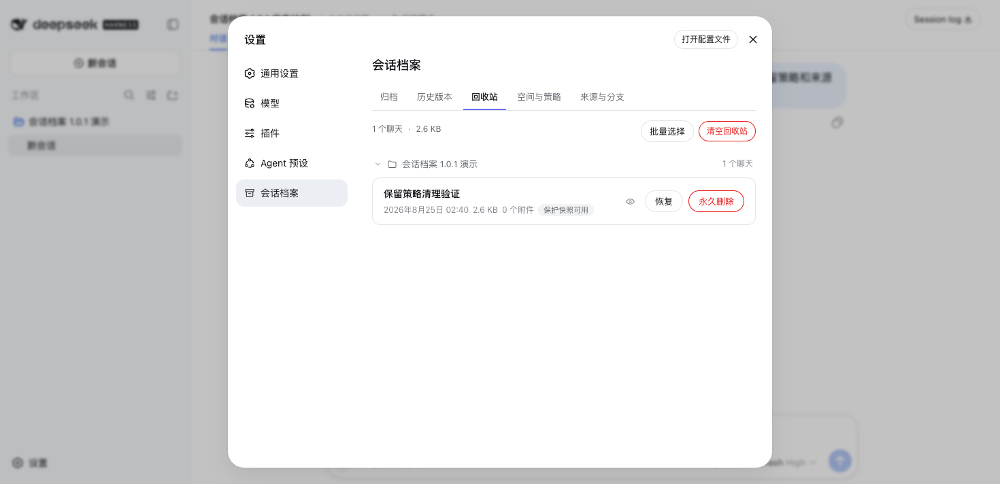
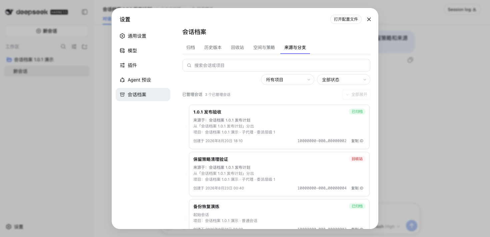

<div align="center">

<h1>Session Archive</h1>

<p><strong>A local archived-chat center for DeepSeek Harness</strong></p>
<p><code>dsh-archived-chats</code></p>

<p>
  <a href="https://www.npmjs.com/package/dsh-archived-chats"></a>
  <a href="https://www.npmjs.com/package/dsh-archived-chats"></a>
  <a href="https://github.com/Ultronen/dsh-archived-chats/actions/workflows/ci.yml"></a>
  <a href="https://github.com/Ultronen/dsh-archived-chats/actions/workflows/ci.yml"></a>
</p>
<p>
  <a href="https://github.com/Ultronen/dsh-archived-chats/blob/main/LICENSE"></a>
  <a href="https://github.com/deepseek-ai/deepseek-harness"></a>
  <a href="https://awesome-dsh-plugin.com/p/Ultronen/dsh-archived-chats/"></a>
  <a href="https://github.com/Ultronen/dsh-archived-chats/stargazers"></a>
</p>

<p>English · <a href="README.md">中文</a></p>

</div>

> 🔎 **Archived no longer means lost.** Search and read complete conversations, inspect local history versions, then back up, restore as a copy, or delete safely.

> ♻️ **Removing an archived chat from this plugin is undoable.** The plugin first creates a local recovery snapshot containing the session and attachments, then moves it to the Recycle Bin. Physical removal happens only after an explicit **Delete permanently** action in the Recycle Bin.

A local archived-chat manager for [DeepSeek Harness](https://github.com/deepseek-ai/deepseek-harness): search and preview complete conversations, retain a validated local version after archive, restore any healthy version as a new archived copy, and manage old chats through backups, an undoable Recycle Bin, retention policies, and Origins & Branches.

Once a conversation is archived in DeepSeek Harness it disappears from the sidebar, and there is no built-in way to browse it again — only the workspace store (`~/.dsh/storages/workspace.json`) still remembers it. This plugin adds a **Session Archive** page under Settings where every archived session is visible, searchable, and manageable.

> ℹ️ **The entry has been formally renamed.** The former **Archived Chats** entry is now **Session Archive** (中文：**会话档案**). The npm package `dsh-archived-chats`, GitHub repository, install command, and local data location are unchanged. Existing users do not need a data migration; after updating, open **Settings → Session Archive**.

<p align="center"><a href="https://awesome-dsh-plugin.com/p/Ultronen/dsh-archived-chats/">Plugin market</a> · <a href="https://www.npmjs.com/package/dsh-archived-chats">npm</a> · <a href="https://github.com/Ultronen/dsh-archived-chats/releases">Releases</a> · <a href="https://github.com/Ultronen/dsh-archived-chats/discussions">Questions and feedback</a> · <a href="https://github.com/Ultronen/dsh-archived-chats/security/advisories/new">Private vulnerability reporting</a></p>

<p align="center">
  <a href="assets/screenshots/preview-03.png"></a>
  <a href="assets/screenshots/preview-07.png"></a>
</p>

<p align="center"><sub>Search and read without unarchiving first; removing an archived chat here moves it through a recovery-snapshot Recycle Bin.</sub></p>

If this plugin helps you recover or protect an important conversation, consider starring the repository so people who need archived-chat recovery can discover it more easily.

## 🚀 Install

```sh
dsh plugin --profile web add dsh-archived-chats@latest
```

Restart DSH once after installing, then open **Settings → Session Archive**.

To update an existing installation:

```sh
dsh plugin --profile web update dsh-archived-chats
```

## Compatibility

The plugin enables features from the public capabilities exposed by the DeepSeek Harness Host instead of binding to one Host version. Archived browsing, full-text search, native read-only preview, History, Recycle Bin, storage policies, and session lineage work when their corresponding services are available. ZIP import, History **Restore as copy**, and snapshot fallback when an original is missing require a public persistence writer. Without it, the operation returns `restore-unsupported` without writing or overwriting data. If the attachment service is unavailable, only image reads degrade; the rest of the conversation remains readable. Back up `$DSH_HOME/plugin-data/archived-chats/` before downgrading to an older release that does not display History or understand recycle snapshots.

## Demo Preview

These images use an isolated Chinese light-theme Web demo environment with synthetic conversations to show the real current release UI. They contain no real user data, paths, notes, or credentials. The README and plugin market use the same fixed demo image set.










## Usage

1. Archive a conversation from the normal DSH session menu. After Host success, the notice first reports **saving history version** and starts its three-second dismissal only after save. Snapshot failure never rolls back archive success; the notice retains **Retry save**, **View**, **Undo**, and close actions.
2. Open **Settings → Session Archive → History**. Groups can be searched by safe title/workspace and expanded to preview any healthy version read-only or choose **Restore as copy**. The Host generates a new session ID and registers the result as archived; it never overwrites, unarchives, or deletes the source.
3. Delete one ordinary History version after confirmation, or use **Clear history versions** to remove all ordinary history at once. The source chat remains unchanged, while Recycle Bin protection and unreadable degraded versions are skipped.
4. Use **Archived** to manage chats by workspace and search titles, tags, notes, message text, or tool output. Row preview does not require unarchive.
5. Use **Import backup / Export backup** for ZIP backups. ZIP import and history restore are separate flows.
6. **Move to Recycle Bin** reuses a healthy snapshot for the same revision when possible and otherwise publishes a new protection snapshot. Only **Delete permanently / Empty Recycle Bin** irreversibly removes the original and every validated snapshot for that source.
7. Use **Storage & Retention** to preview and explicitly apply history-count, age, quota, and recycle-age policy. **Origins & Branches** remains a read-only tree of necessary relationship context.

## Features

- **Complete archived-session list**, grouped by workspace (project) with a per-group count. Every group can be collapsed or expanded, and the state is remembered per browser.
- **Archive success notice**: after a chat is archived, a compact frame-wide notice remains for three seconds with **View**, **Undo**, and close actions. Pointer hover or keyboard focus pauses the timer, active View/Undo work cannot time out, and failures retain a retry action.
- **Local history after archive**: only a successful browser-originated archive captures a validated version, deduplicated by the same non-null source revision. The plugin never scans unrelated active chats and performs no startup, scheduled, or background capture.
- **History timeline, restore, and deletion**: the fifth History tab shows timestamp, size, attachment count, recycle-protection state, and opaque degraded items by original chat. Preview is read-only and restore always creates a new archived ID. Ordinary history can be deleted individually or cleared globally after confirmation and cannot then be recovered. Original chats remain unchanged; recycle-protection and degraded snapshots are skipped.
- **Full-text conversation search**: one search field matches titles, workspaces, tags, notes, user messages, assistant answers, and tool results, with a readable hit excerpt on each matching row.
- **Native archived conversation preview and turn navigation**: follow the Harness conversation layout with user messages on the right and assistant messages on the left; present Markdown, reasoning, tool activity, JSON, code, and available stored images read-only, while retaining a responsive turn rail for quick jumps. If the host lacks attachment capability, only images degrade and the rest of the preview remains readable.
- **Filter and sort** by type (all / regular / subagent), project, and tag; then order results by newest, oldest, or title.
- **Tags and notes**: open an editor from any row to attach up to 8 tags (24 Unicode characters each) and a note (2,000 Unicode characters). Tag chips render per row, overflowing past three into a `+N` indicator, and the tag filter narrows the list case-insensitively.
- **Storage insights**: a summary strip reports the archived count, total measured size, and how many sessions could not be measured; each row shows its own size. Measurement never follows symbolic links and skips sessions whose directories are unreadable.
- **JSON + Markdown backups**: export one row, the current selection, or every archived chat as a ZIP. Each package has a versioned manifest, a lossless machine-readable session record, and a human-readable transcript for every included session.
- **Preview-first import and restore**: choose a ZIP backup, inspect every session before writing, preselect only non-conflicting IDs, and restore selected sessions as archived chats. Existing IDs are skipped and never overwritten.
- **Compact top-level actions**: common **Import backup** / **Export backup** actions are direct, while the low-frequency destructive action lives under **More**. The page stays focused on DSH archive management without a persistent source selector or redundant menus.
- **On-demand multi-select**: checkboxes stay hidden by default and appear only after clicking **Select multiple**. Select individual chats, every visible result, or an entire project; the selection bar can export, unarchive, or move the chosen chats to the Recycle Bin, while selections hidden by another filter remain intact.
- **Unarchive** a single chat or a whole project group from the group's `⋯` menu — restored chats reappear in the sidebar immediately.
- **Five archive-management views**: Archived, History, Recycle Bin, Storage & Retention, and Origins & Branches. History loads only on first activation; Recycle Bin stays grouped by original workspace with independent disclosure state.
- **Storage analysis**: separately measures archived/recycled session directories and plugin-owned snapshots, with unavailable/degraded diagnostics and repeated snapshot-attachment bytes. Searchable detail dialogs open from the summary cards, so long inventories never push retention controls down the page. It does not label these numbers as globally reclaimable Harness attachment storage.
- **Preview-first retention policies**: plan by retained recovery snapshots per original chat, snapshot age, snapshot quota, and recycle age. The default keeps one recovery snapshot per original chat. Saving never runs cleanup; snapshots in use by Recycle Bin or unavailable snapshots are excluded and permanent recycle purges start unselected.
- **Read-only Origins & Branches**: uses durable Harness `parentSession` fields to show the sources, forks, and subagent trees of archived/recycled chats, retaining only the parent/child context needed to explain them. Unrelated active chats are not sent to the browser. Managed cards keep source copy inside the card and put a centered disclosure arrow on its own bottom row; users can click the whole card or arrow to fold, copy the full ID, use project/status filters, and expand or collapse all. Searching titles, projects, or IDs automatically reveals matching paths; an independently scrolling tree keeps large datasets from extending the page, and root branches default to collapsed above 50 nodes. Missing parents, cycles, and delegation-depth mismatches render in full inside the affected managed card without rewriting relationships.
- **Automatic recovery snapshots and retained history**: moving an archived chat to Recycle Bin captures all events plus verified image bytes. Restore removes the recycle record but deliberately retains the validated snapshot, so retained recovery storage can exist with an empty archive list. Repeated restore/recycle cycles retain older valid snapshots until the user explicitly applies retention or permanently purges the chat.
- **Two-level restore**: when the original session is intact, restore only removes the recycle marker and does not rewrite persistence. If the original is missing, the plugin falls back to the validated session-and-attachment snapshot through public writer capabilities, never overwriting an existing ID.
- **Explicit permanent purge**: only the Recycle Bin exposes permanent delete and empty. The plugin records durable `purge-pending` crash intent before deleting the original and snapshot; interrupted purges retry at startup.
- Works in light and dark schemes; localized in English and 中文.

## Recycle Bin, privacy, and attachment limits

The recycle catalog (`trash.json`) plus history/protection snapshots live under `$DSH_HOME/plugin-data/archived-chats/` and stay on this machine. Attachment bytes are read one at a time, digest-verified, and atomically published. Conversations and attachments are never uploaded, cloud-synced, background-scanned, or scheduled for capture.

Retention policy lives in `retention.json` under the same directory. Policies never run in the background, at startup, or on a timer; every cleanup requires a single-use five-minute preview followed by explicit selection and confirmation.

Permanent Recycle Bin purge removes every validated snapshot attachment copy for that source, but Harness's global attachment store may retain identical bytes because another session still references them or because the host applies its own garbage-collection policy. This plugin does not claim immediate global attachment GC.

## Tags, notes, and statistics

Tags and notes live **only on your machine** in `$DSH_HOME/plugin-data/archived-chats/metadata.json` — they are never uploaded, synced, or sent anywhere else. Unarchiving a session keeps its metadata; a completed physical deletion removes it, while a deferred or failed deletion keeps it intact. Metadata and statistics failures are always non-blocking: the list, unarchive, and deletion keep working even when the metadata store is unreadable or a session directory cannot be measured.

## Export and backup

Every export is a local browser download. A single session and a batch use the same ZIP format:

```text
manifest.json
sessions/001-<safe-title>-<id>/session.json
sessions/001-<safe-title>-<id>/transcript.md
```

`session.json` is the authoritative backup record: it contains the complete metadata and event values returned by Harness persistence plus the archive title, workspace, timestamps, origin, tags, note, and storage facts. `transcript.md` is a readable companion derived with Harness's canonical message projection. ZIP paths are sanitized and collision-safe, and batches are generated one session at a time instead of buffering every transcript together.

Attachment references remain in JSON, but **attachment bytes and descendant sessions are not included**. Use Harness's official Session log export when you need its attachment-complete conversation-tree package.

## Import and restore

Import accepts only this plugin's version-one export ZIPs. The browser first uploads the package for bounded validation and shows a preview containing titles, workspaces, tags, notes, storage facts, ID conflicts, unresolved-workspace warnings, and attachment-reference warnings; raw events and Markdown are never rendered in the preview. Existing session IDs are disabled and skipped, and unresolved workspaces are restored ungrouped. A confirmation token expires after 10 minutes and can be used once. Tags and notes are restored through the same local metadata limits as manual edits. No attachment bytes are restored. Hosts without the supported Harness writer capability return `restore-unsupported` without writing anything.

## FAQ

<details>
<summary><b>Does archiving delete the conversation?</b></summary>

No. DSH hides the conversation from the sidebar and keeps its archived session record. This plugin gives you a settings page for finding, exporting, restoring, unarchiving, or deleting that record.

</details>

<details>
<summary><b>Are history versions screenshots, and can restore overwrite the source?</b></summary>

No. They are locally stored, validated copies of session records and attachments, and preview is read-only. **Restore as copy** asks the Host for a new ID and creates a new archived chat. It never overwrites, deletes, or unarchives the source or mutates the selected snapshot.

</details>

<details>
<summary><b>What happens when an imported backup contains an existing session ID?</b></summary>

The conflicting row is shown in the preview, disabled by default, and skipped. Import never overwrites an existing session.

</details>

<details>
<summary><b>Are attachments included in ZIP backups?</b></summary>

Attachment references are preserved in `session.json`, but attachment bytes and descendant sessions are not included. Use Harness's official Session log export for a complete attachment-bearing conversation tree.

</details>

<details>
<summary><b>Can I restore immediately after moving a session to the Recycle Bin?</b></summary>

Yes. The success notice includes **Undo**, and the Recycle Bin keeps a Restore action. A live session is safely disposed or parked before the recycle record commits. If the host lacks the required capability, the move fails explicitly and leaves the archived session intact.

</details>

<details>
<summary><b>Why are recovery snapshots shown when there are no archived chats?</b></summary>

A recovery snapshot is created before an archived chat moves to the Recycle Bin. Restoring removes the recycle record but deliberately keeps the validated snapshot as recovery history, so it may still use storage after the archive list becomes empty. Delete one ordinary version or use **Clear history versions** from History; a snapshot still protecting Recycle Bin recovery is skipped. Alternatively, set retention count to `0` and run **Preview cleanup → Apply selected cleanup**.

</details>

## Implementation overview

The plugin has two halves: the Host service manages archives, version snapshots, the recycle catalog, and restore/purge transactions, while the browser page provides search, history timelines, read-only preview, backup, restore-as-copy, and explicit confirmations. Mutations go through guarded local routes. Ordinary removal commits only a recycle record; physical removal is reachable only through the Recycle Bin's crash-safe purge flow.

User-facing storage, backup limits, deletion outcomes, and compatibility notes stay in this README. Maintainer details such as route contracts, data flow, restore transactions, live-deletion lifecycle, and failure fallbacks are documented in [ARCHITECTURE.md](docs/ARCHITECTURE.en.md).

## Development

```sh
npm test
```

The suite (`test/*.test.mjs`) covers export/import, history capture/inventory/preview/image authorization, single-use restore-as-copy transactions and rollback, retention, full-text search, and Host/browser smoke and responsive behavior. It uses an isolated temporary DSH home plus mocked host and browser runtimes; it never reads or changes real sessions.

## Version history

### 1.0.1

- Formally document the settings-entry rename from **Archived Chats** to **Session Archive**; package name, repository, install command, and local data location remain unchanged.
- Recapture eight fixed demo images from the current release UI and make the README and plugin market reference the same set.
- Describe compatibility through public Host capabilities rather than repeated RC versions and internal route counts.
- Add the missing user flow for deleting one History version or clearing ordinary History; remove internal plans, QA evidence, and machine paths from the public tree, with an automated hygiene gate preventing recurrence.

### 1.0.0

- Added the fifth **History** tab for validated local versions, recycle-protection state, safe search, and opaque degraded entries grouped by source chat.
- Browser archive success now captures by stable revision; capture failure never rolls back archive and the notice retains safe retry.
- Reused the conversation preview for snapshot timestamps and verified images. Restore always creates a new archived ID and never overwrites the source.
- Added confirmed single-version deletion and global History clearing without selection checkboxes; recycle-protection and degraded snapshots are not removed by these actions.
- Recycle moves may reuse the same healthy non-null revision. Retention continues to govern history, and permanent purge removes every validated snapshot for the source.
- A real Web Host verified plugin loading, safe inventory, and capability degradation; without a writer, restore fails without mutation as `restore-unsupported`.
- **Downgrade reminder:** 0.12 does not show History, but it can validate, retain, and purge version-one snapshots. Back up `$DSH_HOME/plugin-data/archived-chats/` before downgrading.

### 0.12.0

- Added a three-second top notice after archive success, with direct View and Undo, hover/focus pause, and retryable failures.
- Added separate session/snapshot accounting, repeated snapshot-attachment totals, and unavailable/degraded diagnostics.
- Added count/age/quota retention planning with separate save/apply, short-lived single-use previews, and execution-time revalidation.
- Added a read-only Origins & Branches tree scoped to archived/recycled chats and necessary relationship context, with diagnostics for missing parents, cycles, and delegation-depth anomalies.
- Recycle cycles retain prior valid snapshots; permanent purge still removes the original and every valid snapshot through `purge-pending`.
- **Downgrade warning:** 0.11.x does not display or govern multiple histories, though it tolerates them and removes them on permanent purge. Back up `$DSH_HOME/plugin-data/archived-chats/` before downgrading.

### 0.11.0

- Added persistent **Archived / Recycle Bin** tabs, independent recycle selection, trash-scoped preview, restore, permanent purge, and empty actions.
- Ordinary deletion now captures a complete local protection snapshot and moves the session to recoverable trash, with immediate **Undo**.
- Restore prefers the intact original and falls back to a validated session-plus-attachment snapshot without overwriting an existing ID.
- Added durable `purge-pending` recovery, snapshot recovery/degraded states, and safe migration of legacy `pending-deletions.json` IDs into recoverable trash without silent boot deletion.
- **Downgrade warning:** 0.10 does not understand 0.11 recycle records or snapshots. Before downgrading, restore needed sessions in 0.11 and back up `$DSH_HOME/plugin-data/archived-chats/`.

### 0.10.0

- Added archived conversation preview that follows the Harness conversation layout, with user messages on the right, assistant messages on the left, paginated message loading, and a responsive turn rail.
- Markdown, reasoning, tool activity, JSON, code, and available stored images are presented read-only; a missing host attachment capability affects images only, not the rest of the conversation.
- Added full-text search over Unicode conversation text and tool output, merged with the existing title/tag/note filters and displayed as row excerpts.
- Hardened preview and search with guarded local POST routes, bounded bodies and results, four-way inspection concurrency, partial-failure degradation, and a bounded TTL/LRU memory cache.

### 0.9.0

- Added an on-demand multi-select mode: list checkboxes stay hidden until requested, then disappear automatically after a completed bulk action.
- Made common ZIP backup actions direct **Import backup / Export backup** controls and moved the destructive action under **More** for a cleaner header.
- Removed the cross-tool JSONL migration surface that could not provide native resume, keeping the plugin focused on DSH archived-chat management.
- Verified the new controls, backup preview, and single-line page title in a real Host.

### 0.8.1

- Made the Chinese README the default repository and npm entry point; the English guide is now `README.en.md`.
- Moved maintainer architecture, routes, restore transactions, and deletion lifecycle details to `docs/ARCHITECTURE.md` and `docs/ARCHITECTURE.en.md`.
- Added a 🚀 marker to the install heading; runtime behavior remains unchanged from 0.8.0.

### 0.8.0

- Added preview-first import for version-one ZIP backups.
- Added conflict-safe, transaction-based restore without overwriting existing sessions.
- Added workspace and attachment warnings, bounded validation, single-use confirmation tokens, and metadata restoration.

### 0.7.0

- Added versioned JSON + Markdown ZIP backups for single, selected, and all archived sessions.
- Added streaming export, safe ZIP paths, manifest records, and canonical Markdown transcripts.

### 0.6.0

- Added tags, notes, storage statistics, metadata persistence, and the archive insights UI.
- Hardened live deletion and added fallback handling for hosts that do not expose the internal lifecycle hooks.

### 0.5.1

- Published a compatibility-focused patch release.
- Updated the browser settings section to use the overlay and state design tokens exposed by the Host.

### 0.5.0

- Added bulk selection and bulk unarchive/delete workflows.
- Improved destructive-action focus handling and project-wide selection behavior.

### 0.4.0

- Added in-place deletion for live sessions when the host exposes the required lifecycle hooks.
- Added the safe pending-deletion fallback, title caching, and a success toast after destructive actions.

### 0.3.0

- First published release of the Session Archive settings page.
- Added workspace-grouped browsing, title search, type/project filters, unarchive, and confirmed single/group/all deletion.
- Added host routes, the browser settings section, and the pending-deletion sweep for live sessions.

### 0.1.0 and 0.2.0

- These versions were never published to npm and have no repository tags. `0.3.0` is the first public release.

## Uninstall

```sh
dsh plugin --profile web remove dsh-archived-chats
```

Uninstalling does not remove `metadata.json`, `trash.json`, `retention.json`, protection snapshots, or a legacy `pending-deletions.json` under `$DSH_HOME/plugin-data/archived-chats/`, and it never triggers permanent purge. Restore or back up anything you need before manually handling that directory.

## License

MIT
