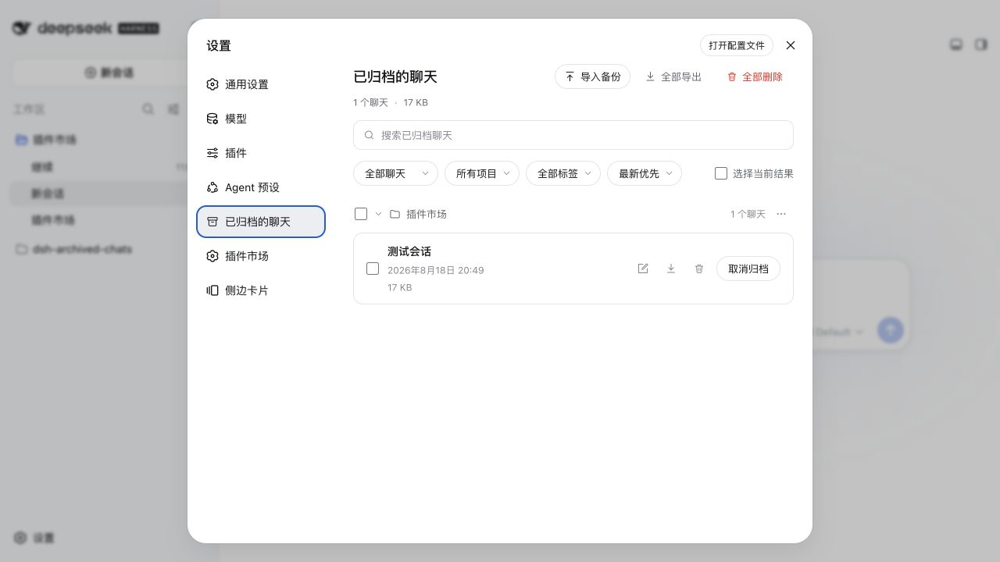
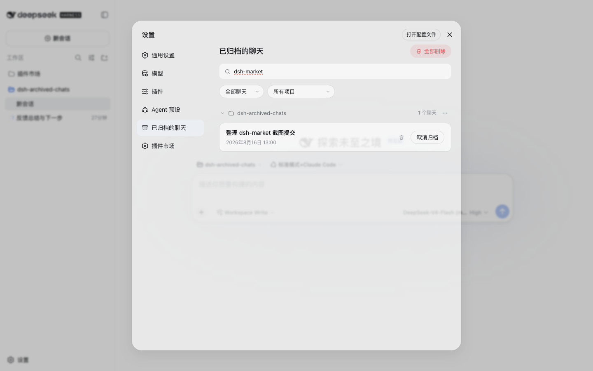
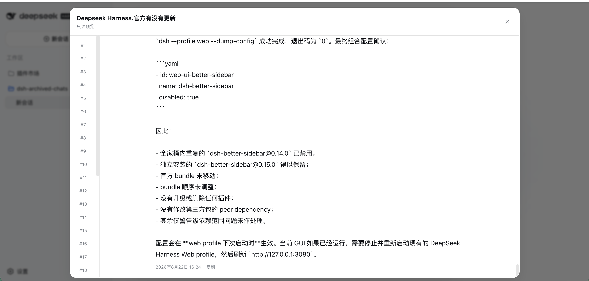
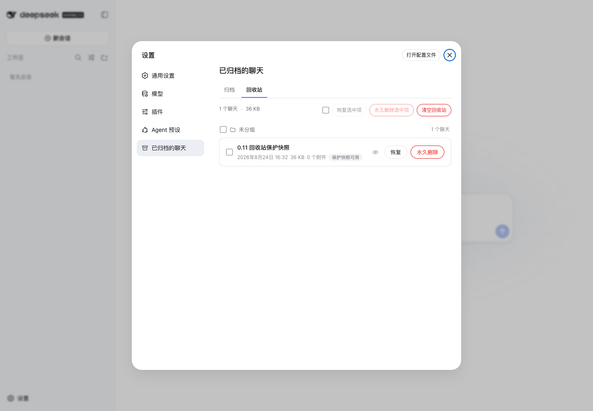
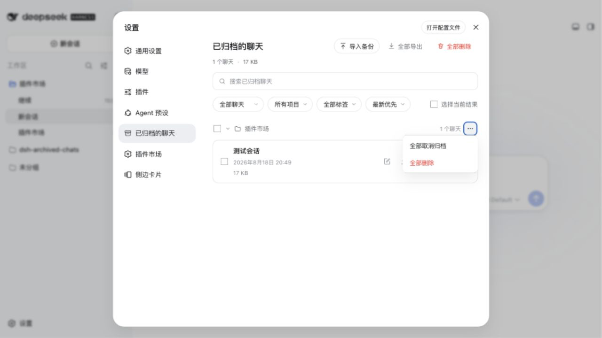
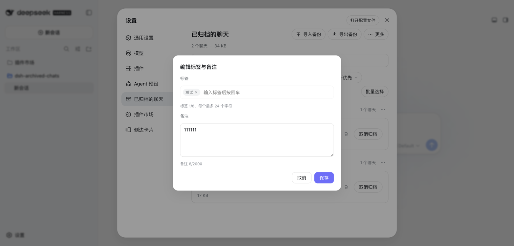
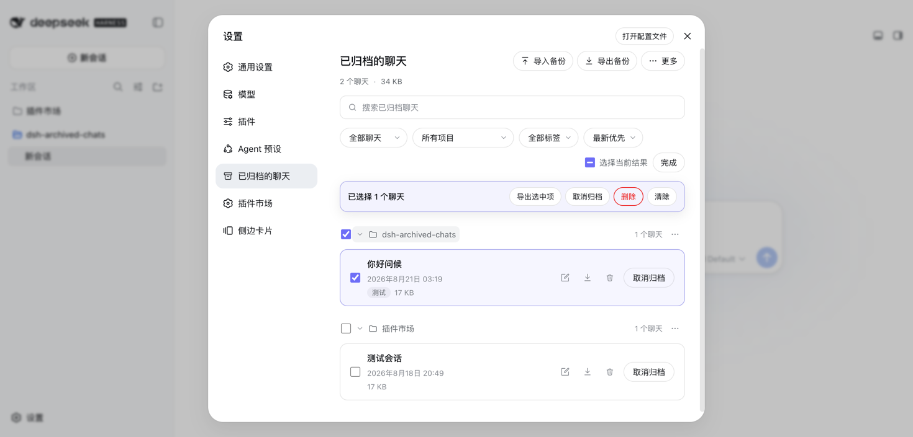
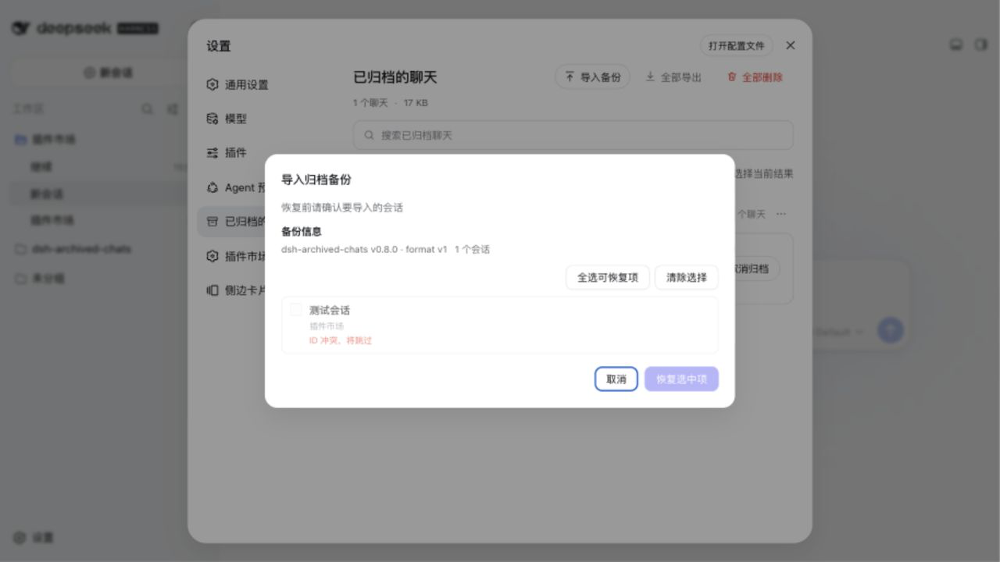

# dsh-archived-chats

[English](README.en.md) | [中文](README.md)

> 🔎 **Archived no longer means lost.** Search conversation content, read complete messages and tool calls, then back up, restore, or delete safely.

> ♻️ **Ordinary deletion is now undoable.** The plugin first creates a local protection snapshot containing the session and attachments, then moves it to the Recycle Bin. Physical removal happens only after an explicit **Delete permanently** action in the Recycle Bin.

A local conversation archive center for [DeepSeek Harness](https://github.com/deepseek-ai/deepseek-harness): recover, search, read, back up, restore, or delete archived sessions.

Once a conversation is archived in DeepSeek Harness it disappears from the sidebar, and there is no built-in way to browse it again — only the workspace store (`~/.dsh/storages/workspace.json`) still remembers it. This plugin adds an **Archived Chats** page under Settings where every archived session is visible, searchable, and manageable.

## 🚀 Install

```sh
dsh plugin --profile web add dsh-archived-chats@latest
```

Restart DSH once after installing, then open **Settings → Archived Chats**.

To update an existing installation:

```sh
dsh plugin --profile web update dsh-archived-chats
```

## Compatibility

The full 0.11.0 feature target is DeepSeek Harness `0.1.1-rc.2`. Older hosts can still expose the archive list, but a missing persistence, attachment, or live-session lifecycle capability produces an explicit capability error instead of guessed internal writes or an incomplete snapshot. The v0.9.0 UI was checked on Harness `0.1.0-rc.8`; v0.10.0 search, preview, and stored-image reads were checked on `0.1.1-rc.2`.

## Preview

Screenshots 1–7 were captured from 0.9.0 in a local DeepSeek Harness `0.1.0-rc.8` web profile. The archived preview is from 0.10.0 and the Recycle Bin is from 0.11.0, both captured in an isolated real DeepSeek Harness `0.1.1-rc.2` host.










## Usage

1. Archive a conversation from the normal DSH session menu. Archiving removes it from the sidebar but keeps its session data in the workspace store.
2. Open **Settings → Archived Chats**. The page groups archived conversations by workspace and remembers collapsed groups in this browser.
3. Search titles, tags, notes, conversation text, or tool output. Open the row preview to read an archived conversation without unarchiving it. Click **Select multiple** only when you need bulk actions.
4. Click **Import backup** to choose a ZIP produced by this plugin and confirm non-conflicting sessions after the preview. Click **Export backup** to export the current selection, or every archived chat when nothing is selected. Individual rows also have an export action.
5. Choose **Unarchive** to return a conversation to the sidebar. **Move to Recycle Bin** creates a protection snapshot and offers immediate **Undo**; the session can also be restored later from the **Recycle Bin** tab. Only **Delete permanently / Empty Recycle Bin** removes originals and snapshots irreversibly.

## Features

- **Complete archived-session list**, grouped by workspace (project) with a per-group count. Every group can be collapsed or expanded, and the state is remembered per browser.
- **Full-text conversation search**: one search field matches titles, workspaces, tags, notes, user messages, assistant answers, and tool results, with a readable hit excerpt on each matching row.
- **Native archived conversation preview and turn navigation**: follow the Harness conversation layout with user messages on the right and assistant messages on the left; present Markdown, reasoning, tool activity, JSON, code, and available stored images read-only, while retaining a responsive turn rail for quick jumps. If the host lacks attachment capability, only images degrade and the rest of the preview remains readable.
- **Filter and sort** by type (all / regular / subagent), project, and tag; then order results by newest, oldest, or title.
- **Tags and notes**: open an editor from any row to attach up to 8 tags (24 Unicode characters each) and a note (2,000 Unicode characters). Tag chips render per row, overflowing past three into a `+N` indicator, and the tag filter narrows the list case-insensitively.
- **Storage insights**: a summary strip reports the archived count, total measured size, and how many sessions could not be measured; each row shows its own size. Measurement never follows symbolic links and skips sessions whose directories are unreadable.
- **JSON + Markdown backups**: export one row, the current selection, or every archived chat as a ZIP. Each package has a versioned manifest, a lossless machine-readable session record, and a human-readable transcript for every included session.
- **Preview-first import and restore**: choose a ZIP backup, inspect every session before writing, preselect only non-conflicting IDs, and restore selected sessions as archived chats. Existing IDs are skipped and never overwritten.
- **Compact top-level actions**: common **Import backup** / **Export backup** actions are direct, while the low-frequency destructive action lives under **More**. The page stays focused on DSH archive management without a persistent source selector or redundant menus.
- **On-demand multi-select**: checkboxes stay hidden by default and appear only after clicking **Select multiple**. Select individual chats, every visible result, or an entire project; the selection bar can export, unarchive, or move the chosen chats to the Recycle Bin, while selections hidden by another filter remain intact.
- **Unarchive** a single chat or a whole project group from the group's `⋯` menu — restored chats reappear in the sidebar immediately.
- **Archived / Recycle Bin tabs**: recycled rows stay grouped by their original workspace and show trash time, snapshot size, attachment count, and `trashed` / `degraded` / `purge-pending` state. Recycle selection is independent from archive selection.
- **Automatic protection snapshots**: moving a session captures all conversation events plus verified stored-image bytes before the recycle record commits. One current protection snapshot is kept per session; 0.11 does not provide historical retention or conversation-tree restoration.
- **Two-level restore**: when the original session is intact, restore only removes the recycle marker and does not rewrite persistence. If the original is missing, the plugin falls back to the validated session-and-attachment snapshot through public writer capabilities, never overwriting an existing ID.
- **Explicit permanent purge**: only the Recycle Bin exposes permanent delete and empty. The plugin records durable `purge-pending` crash intent before deleting the original and snapshot; interrupted purges retry at startup.
- Works in light and dark schemes; localized in English and 中文.

## Recycle Bin, privacy, and attachment limits

The recycle catalog (`trash.json`) and protection snapshots live under `$DSH_HOME/plugin-data/archived-chats/` and stay on this machine. Attachment bytes are read one at a time, digest-verified, and atomically published; neither conversations nor attachments are uploaded. Recycle previews use a separate authorized scope.

Permanent purge removes the snapshot's attachment copies, but Harness's global attachment store may retain identical bytes because another session still references them or because the host applies its own garbage-collection policy. This plugin does not claim immediate global attachment GC.

## Tags, notes, and statistics

Tags and notes live **only on your machine** in `$DSH_HOME/plugin-data/archived-chats/metadata.json` — they are never uploaded, synced, or sent anywhere else. Unarchiving a session keeps its metadata; a completed physical deletion removes it, while a deferred or failed deletion keeps it intact. Metadata and statistics failures are always non-blocking: the list, unarchive, and deletion keep working even when the metadata store is unreadable or a session directory cannot be measured.

## Export and backup

Every export is a local browser download. A single session and a batch use the same ZIP format:

```text
manifest.json
sessions/001-<safe-title>-<id>/session.json
sessions/001-<safe-title>-<id>/transcript.md
```

`session.json` is the authoritative backup record: it contains the complete metadata and event values returned by Harness persistence plus the archive title, workspace, timestamps, origin, tags, note, and storage facts. `transcript.md` is a readable companion derived with Harness's canonical message projection. ZIP paths are sanitized and collision-safe, and batches are generated one session at a time instead of buffering every transcript together.

Attachment references remain in JSON, but **attachment bytes and descendant sessions are not included**. Use Harness's official Session log export when you need its attachment-complete conversation-tree package.

## Import and restore

Import accepts only this plugin's version-one export ZIPs. The browser first uploads the package for bounded validation and shows a preview containing titles, workspaces, tags, notes, storage facts, ID conflicts, unresolved-workspace warnings, and attachment-reference warnings; raw events and Markdown are never rendered in the preview. Existing session IDs are disabled and skipped, and unresolved workspaces are restored ungrouped. A confirmation token expires after 10 minutes and can be used once. Tags and notes are restored through the same local metadata limits as manual edits. No attachment bytes are restored. Hosts without the supported Harness writer capability return `restore-unsupported` without writing anything.

## FAQ

<details>
<summary><b>Does archiving delete the conversation?</b></summary>

No. DSH hides the conversation from the sidebar and keeps its archived session record. This plugin gives you a settings page for finding, exporting, restoring, unarchiving, or deleting that record.

</details>

<details>
<summary><b>What happens when an imported backup contains an existing session ID?</b></summary>

The conflicting row is shown in the preview, disabled by default, and skipped. Import never overwrites an existing session.

</details>

<details>
<summary><b>Are attachments included in ZIP backups?</b></summary>

Attachment references are preserved in `session.json`, but attachment bytes and descendant sessions are not included. Use Harness's official Session log export for a complete attachment-bearing conversation tree.

</details>

<details>
<summary><b>Can I restore immediately after moving a session to the Recycle Bin?</b></summary>

Yes. The success notice includes **Undo**, and the Recycle Bin keeps a Restore action. A live session is safely disposed or parked before the recycle record commits. If the host lacks the required capability, the move fails explicitly and leaves the archived session intact.

</details>

## Implementation overview

The plugin has two halves: the Host service manages archives, snapshots, the recycle catalog, and restore/purge transactions, while the browser page provides search, preview, backup, restore, and explicit confirmations. Mutations go through guarded local routes. Ordinary removal commits only a recycle record; physical removal is reachable only through the Recycle Bin's crash-safe purge flow.

User-facing storage, backup limits, deletion outcomes, and compatibility notes stay in this README. Maintainer details such as route contracts, data flow, restore transactions, live-deletion lifecycle, and failure fallbacks are documented in [ARCHITECTURE.md](docs/ARCHITECTURE.en.md).

## Development

```sh
npm test
```

The suite (`test/*.test.mjs`) covers export records and real ZIP decoding, bounded import validation, restore transactions, metadata and statistics, full-text search, conversation preview, and host-and-browser smoke tests. It uses an isolated temporary DSH home plus mocked host and browser runtimes; it never reads or changes real sessions.

## Version history

### 0.11.0

- Added persistent **Archived / Recycle Bin** tabs, independent recycle selection, trash-scoped preview, restore, permanent purge, and empty actions.
- Ordinary deletion now captures a complete local protection snapshot and moves the session to recoverable trash, with immediate **Undo**.
- Restore prefers the intact original and falls back to a validated session-plus-attachment snapshot without overwriting an existing ID.
- Added durable `purge-pending` recovery, snapshot recovery/degraded states, and safe migration of legacy `pending-deletions.json` IDs into recoverable trash without silent boot deletion.
- **Downgrade warning:** 0.10 does not understand 0.11 recycle records or snapshots. Before downgrading, restore needed sessions in 0.11 and back up `$DSH_HOME/plugin-data/archived-chats/`.

### 0.10.0

- Added archived conversation preview that follows the Harness conversation layout, with user messages on the right, assistant messages on the left, paginated message loading, and a responsive turn rail.
- Markdown, reasoning, tool activity, JSON, code, and available stored images are presented read-only; a missing host attachment capability affects images only, not the rest of the conversation.
- Added full-text search over Unicode conversation text and tool output, merged with the existing title/tag/note filters and displayed as row excerpts.
- Hardened preview and search with guarded local POST routes, bounded bodies and results, four-way inspection concurrency, partial-failure degradation, and a bounded TTL/LRU memory cache.

### 0.9.0

- Added an on-demand multi-select mode: list checkboxes stay hidden until requested, then disappear automatically after a completed bulk action.
- Made common ZIP backup actions direct **Import backup / Export backup** controls and moved the destructive action under **More** for a cleaner header.
- Removed the cross-tool JSONL migration surface that could not provide native resume, keeping the plugin focused on DSH archived-chat management.
- Verified the new controls, backup preview, and single-line page title in a real DeepSeek Harness `0.1.0-rc.8` host.

### 0.8.1

- Made the Chinese README the default repository and npm entry point; the English guide is now `README.en.md`.
- Moved maintainer architecture, routes, restore transactions, and deletion lifecycle details to `docs/ARCHITECTURE.md` and `docs/ARCHITECTURE.en.md`.
- Added a 🚀 marker to the install heading; runtime behavior remains unchanged from 0.8.0.

### 0.8.0

- Added preview-first import for version-one ZIP backups.
- Added conflict-safe, transaction-based restore without overwriting existing sessions.
- Added workspace and attachment warnings, bounded validation, single-use confirmation tokens, and metadata restoration.

### 0.7.0

- Added versioned JSON + Markdown ZIP backups for single, selected, and all archived sessions.
- Added streaming export, safe ZIP paths, manifest records, and canonical Markdown transcripts.

### 0.6.0

- Added tags, notes, storage statistics, metadata persistence, and the archive insights UI.
- Hardened live deletion and added fallback handling for hosts that do not expose the internal lifecycle hooks.

### 0.5.1

- Published a compatibility-focused patch release for DeepSeek Harness `0.1.0-rc.7`.
- Updated the browser settings section to use the rc.7 overlay and state design tokens.

### 0.5.0

- Added bulk selection and bulk unarchive/delete workflows.
- Improved destructive-action focus handling and project-wide selection behavior.

### 0.4.0

- Added in-place deletion for live sessions when the host exposes the required lifecycle hooks.
- Added the safe pending-deletion fallback, title caching, and a success toast after destructive actions.

### 0.3.0

- First published release of the Archived Chats settings page.
- Added workspace-grouped browsing, title search, type/project filters, unarchive, and confirmed single/group/all deletion.
- Added host routes, the browser settings section, and the pending-deletion sweep for live sessions.

### 0.1.0 and 0.2.0

- These versions were never published to npm and have no repository tags. `0.3.0` is the first public release.

## Uninstall

```sh
dsh plugin --profile web remove dsh-archived-chats
```

Uninstalling does not remove `metadata.json`, `trash.json`, protection snapshots, or a legacy `pending-deletions.json` under `$DSH_HOME/plugin-data/archived-chats/`, and it never triggers permanent purge. Restore or back up anything you need before manually handling that directory.

## License

MIT
