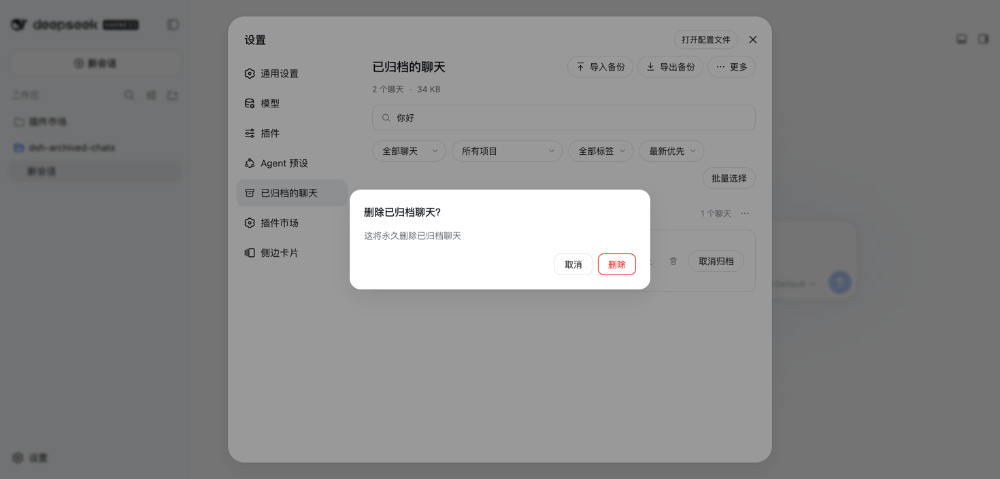
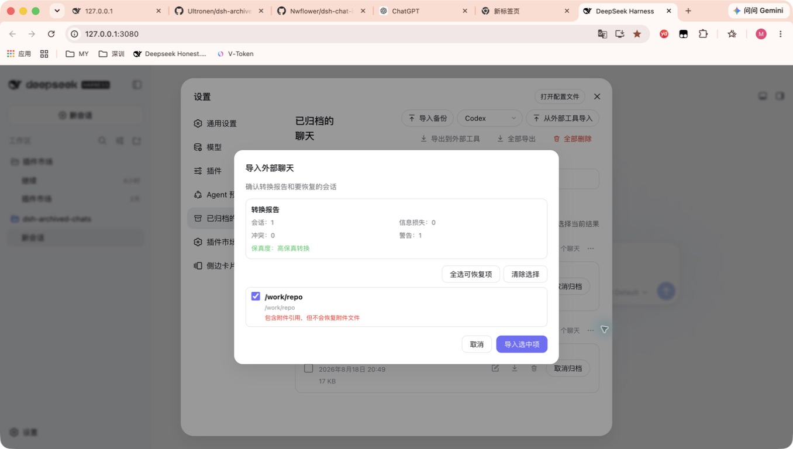
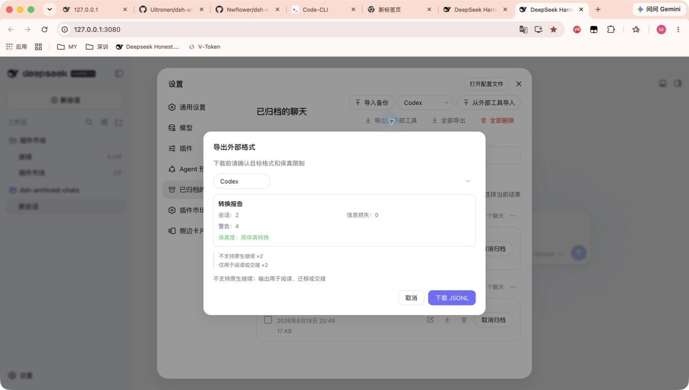

# dsh-archived-chats

[English](README.en.md) | 中文

> ⚡ **删除即生效，无需重启。** 即使会话仍驻留在后台，也会沿官方生命周期当场安全拆除并从磁盘彻底删除——点下删除的那一刻就删干净，而不是"停用后等下次重启"。

为 [DeepSeek Harness](https://github.com/deepseek-ai/deepseek-harness) 新增一个「已归档的聊天」设置页，把被归档的会话重新找回来。

在 DeepSeek Harness 里，聊天一旦归档就会从侧边栏消失，界面中没有任何入口可以再看到它，只有工作区存档（`~/.dsh/storages/workspace.json`）还记得它。这个插件在「设置」中补上一个「已归档的聊天」页面，让所有归档会话都可见、可搜索、可管理。

## 🚀 安装

```sh
dsh plugin --profile web add dsh-archived-chats@latest
```

安装后重启一次 DSH，然后打开 **设置 → 已归档的聊天**。

更新已有安装：

```sh
dsh plugin --profile web update dsh-archived-chats
```

## 兼容性

0.9.0 版本以 DeepSeek Harness `0.1.0-rc.7` 作为自动化兼容性基线。插件注册的是顶层 `settings.section`，因此 rc.7 针对 `settings.plugin.item` 的 keyed-slot 变更不影响本插件；同时已在 Harness `0.1.0-rc.8` 上完成真实宿主页面复核，覆盖归档列表、搜索、元数据编辑、批量与分组操作、备份导入预览，以及 Codex / Claude Code 互操作控件和转换报告。以后 Harness 发布新版本时，仍应在发布插件更新前重跑冒烟测试并检查真实宿主页面，因为客户端插槽和设计令牌契约仍可能演进。

## 预览

总览、批量操作与外部导入预览截图来自 `0.9.0` 在本地 DeepSeek Harness `0.1.0-rc.8` Web profile 中的实际操作；其余截图保留 0.8.x 中未改变的工作流。








## 使用流程

1. 在 DSH 正常聊天的会话菜单中点击归档。归档只会把会话从侧边栏隐藏，工作区存档仍会保留会话数据。
2. 打开 **设置 → 已归档的聊天**。页面按工作区分组，并在当前浏览器中记住分组的折叠状态。
3. 搜索、筛选或排序会话；需要多选时点击 **批量选择** 显示复选框，完成后会自动恢复简洁列表。也可打开某一行的元数据编辑器添加标签与备注，或使用分组菜单执行项目级操作。
4. 从 Codex 或 Claude Code 迁移时，在顶部 **导入** 菜单直接选择对应来源并打开 JSONL 文件；查看转换报告、信息损失、警告和 ID 冲突后，只确认需要恢复的非冲突会话。
5. 要把归档会话交接给 Codex 或 Claude Code，选择一个或多个会话（不选择时使用全部会话），在顶部 **导出** 菜单选择目标，先检查会话数、信息损失类别/计数、警告和原生继续限制，再下载 JSONL。
6. DSH ZIP 备份与跨工具 JSONL 交接用途不同：在 **导出 → 导出 DSH 备份** 导出单条、当前选中项或全部归档会话；恢复时选择 **导入 → 导入 DSH 备份**，预览后确认无冲突会话。
7. 点击 **取消归档** 将会话放回侧边栏；只有确实需要永久删除时才点击 **删除**，确认弹窗会明确显示受影响的范围。

## 功能

- **完整归档列表**：按工作区（项目）分组并显示每组数量；每个分组都可折叠/展开，状态按浏览器记忆。
- **搜索与排序**：按标题、项目名、标签和备注内容搜索，用类型（全部 / 普通会话 / 子代理会话）、项目和标签筛选，并按最新、最早或标题排序。
- **标签与备注**：任意行打开编辑器即可添加最多 8 个标签（每个最多 24 个 Unicode 字符）和一条备注（最多 2,000 个 Unicode 字符）。每行渲染标签小徽章，超过 3 个折叠为 `+N`，标签筛选不区分大小写。
- **存储统计**：概览条显示归档数量、已统计总大小与无法统计的会话数；每行显示各自占用。统计不会跟随符号链接，无法读取的会话目录显示为「无法统计」而非让请求失败。
- **JSON + Markdown 备份**：可导出单条、当前选中项或全部归档会话。每个 ZIP 都包含带版本的清单、用于机器恢复的完整会话 JSON，以及方便阅读的 Markdown 对话稿。
- **预览后导入与恢复**：选择 ZIP 备份后先检查全部会话，默认选中无冲突 ID 的项目，确认后作为已归档聊天恢复。已有 ID 会跳过，绝不会覆盖。
- **Codex / Claude Code 互操作**：只读检查外部 JSONL，在写入前展示会话数、信息损失、冲突、警告和保真度；导出同样先生成不含消息正文的损失/警告报告，再把选中的 DSH 归档会话下载为面向目标工具的可读 JSONL 交接稿。
- **紧凑顶部操作**：备份与跨工具迁移分别收纳在 **导入** / **导出** 菜单中，低频危险操作收纳在 **更多**，页头不再常驻来源选择器和多组长按钮。
- **按需多选**：复选框默认隐藏，点击 **批量选择** 后才显示；可逐条选择、选择当前筛选结果或整个项目。选中后可一次导出、取消归档或永久删除，隐藏在其他筛选结果中的选择不会丢失。
- **取消归档**单个聊天，或从分组的 `⋯` 菜单整组取消——恢复的聊天会立刻回到侧边栏。
- **删除**单个聊天、某个项目分组或全部（**全部删除**），均有确认弹窗。删除是彻底的：会话日志从磁盘移除、从工作区记录中摘除、注册表内存索引同步清理，主侧边栏的条目也会立即消失。
- 仍驻留后台的会话也**当场删除**：插件按官方生命周期的拆除顺序原地停用并注销会话（取消 → 静默 → 落盘 → 拆纤程 → 摘出注册表），持久层随之释放写入通道，同一次请求内即完成物理删除——无需重启。若当前 DSH 版本不提供所需内部接口，则自动回退为「永久停用 + 下次启动完成删除」，停用期间会话保持隐藏。
- 适配浅色/深色主题，支持中文和英文界面。

## 标签、备注与统计

标签和备注**只保存在本机**的 `$DSH_HOME/plugin-data/archived-chats/metadata.json` 中——不会被上传、同步或发送到任何其他地方。取消归档会保留元数据；物理删除完成后会移除它，而延后或失败的删除会保留它。元数据与统计失败永远不阻塞：即使元数据存储无法读取或某个会话目录无法统计，列表、取消归档和删除仍然可用。

## 导出与备份

导出只会触发本地浏览器下载。单条和批量使用同一种 ZIP 格式：

```text
manifest.json
sessions/001-<安全标题>-<id>/session.json
sessions/001-<安全标题>-<id>/transcript.md
```

`session.json` 是权威备份记录：原样保存 Harness 持久层返回的完整元数据和事件，并附带归档标题、工作区、时间、来源、标签、备注和存储统计。`transcript.md` 是通过 Harness 官方消息投影生成的可读副本。ZIP 路径会净化并处理重名，批量导出逐个会话生成，不会同时把所有会话内容堆进内存。

JSON 会保留附件引用，但**本版不复制附件二进制，也不包含子会话**。需要带完整附件的会话树时，请使用 Harness 官方的 Session log 导出。

## 导入与恢复

导入只接受本插件版本一的导出 ZIP。浏览器会先上传并进行有界校验，然后展示标题、项目、标签、备注、存储信息、ID 冲突、项目不存在警告和附件引用警告；预览不会渲染原始事件或 Markdown。已有会话 ID 会被禁用并跳过，找不到的项目会恢复为未分组。确认令牌 10 分钟后过期且只能使用一次。标签和备注通过现有本地元数据限制恢复，不会恢复附件二进制。宿主没有可用的 Harness 写入能力时返回 `restore-unsupported`，不会写入任何数据。

## Codex 与 Claude Code 互操作

0.9.0 支持把 Codex 或 Claude Code 的本地 JSONL 转换为 DSH 已归档会话，也支持把 DSH 归档会话导出为对应目标的 JSONL。外部导入只接受单个 JSONL 文件；上传请求上限为 8 MiB，并进一步限制行数、单行大小和结构复杂度。检查阶段只读源文件，不会改写、移动或删除它，也不会把原始消息或本地路径写入插件日志。

导入始终先预览后恢复。报告中的「高保真转换」表示未发现已知信息损失；「可读迁移」表示对话仍可阅读，但存在无法完整映射的事件、字段或内容块。畸形 JSON、未知事件、附件引用和重复/现有会话会明确计入损失、警告或冲突；冲突默认不选中且永不覆盖。确认仍复用 10 分钟、一次性的恢复令牌和事务回滚路径。

附件只保留安全的相对引用，**不会复制或恢复二进制文件**。外部导出会先返回净化后的会话数、损失类别/计数和警告；报告不包含消息正文，目标变化时会重新检查。下载的 JSONL 是用于阅读、迁移或交接的对话投影，不承诺 Codex 或 Claude Code 能原生 `resume`；导出不会修改 DSH 会话，也不会接触目标工具的源目录、凭据、MCP 密钥或本地配置。

## 常见问题

<details>
<summary><b>归档会删除聊天吗？</b></summary>

不会。DSH 只是把聊天从侧边栏隐藏，并保留归档会话记录。这个插件提供设置页，用来查找、导出、恢复、取消归档或删除这些记录。

</details>

<details>
<summary><b>导入备份包含已存在的会话 ID 时会怎样？</b></summary>

冲突行会在预览中明确标记，默认禁用并跳过。导入流程绝不会覆盖已有会话。

</details>

<details>
<summary><b>ZIP 备份包含附件吗？</b></summary>

`session.json` 会保留附件引用，但不会包含附件二进制或子会话。需要完整附件会话树时，请使用 Harness 官方 Session log 导出。

</details>

<details>
<summary><b>导出的 Codex / Claude Code JSONL 可以直接继续原会话吗？</b></summary>

不保证。它是可读迁移与交接格式，会保留可映射的消息和工具轨迹，但不是目标工具的原生会话存档。下载前的对话框会明确提示不支持原生继续。

</details>

<details>
<summary><b>删除仍在运行的会话需要重启吗？</b></summary>

在提供所需生命周期接口的宿主上，删除会在同一次请求中拆除运行中的会话并移除文件。较旧或不兼容的宿主会使用安全的待删队列，在下次启动时完成物理删除。

</details>

## 实现概览

插件由两部分组成：Host 服务层负责读取和修改本地归档数据，浏览器设置页负责搜索、筛选、备份、恢复和跨工具转换。Codex / Claude Code 适配器先投影到带版本和 SHA-256 完整性校验的 `dsh-interop` v1 领域模型；所有修改都通过受保护的本地路由完成。导入会先预览，删除会优先尝试安全的生命周期拆除，能力不足时回退到下次启动处理。

普通用户需要了解的数据保存、备份限制、删除结果和兼容性说明已列在本 README 中。路由清单、数据流、恢复事务、实时删除生命周期和失败回退等维护者细节请参阅 [架构文档](docs/ARCHITECTURE.md)。

## 开发

```sh
npm test
```

测试套件（`test/*.test.mjs`）覆盖导出记录与真实 ZIP 解包、有界导入校验、恢复事务、元数据存储、统计服务、`dsh-interop` 格式和 SHA-256、Codex / Claude Code fixtures 与往返转换，以及宿主+浏览器冒烟测试。测试使用隔离的临时 DSH 主目录和模拟运行时，不会读取或修改真实会话。

## 版本更新记录

### 0.9.0

- 新增 Codex 与 Claude Code JSONL 的预览后导入，并复用冲突安全、一次性令牌和事务恢复流程。
- 新增面向 Codex / Claude Code 的可读迁移与交接导出，下载前展示净化后的损失/警告报告，并明确标注不支持原生继续和附件二进制。
- 新增 `dsh-interop` v1 交换模型、SHA-256 完整性校验、转换损失/警告/冲突报告，以及对应 fixtures、路由和浏览器测试。
- 新增按需显示的批量选择模式：列表默认不展示复选框，点击入口后才显示，完成批量操作后自动退出。
- 将备份、Codex / Claude Code 互操作和危险操作收纳为 **导入 / 导出 / 更多** 三组菜单，精简页头布局。
- 在 DeepSeek Harness `0.1.0-rc.8` 真实宿主中复核新控件、转换预览和标题单行布局。

### 0.8.1

- 将中文 README 设为仓库和 npm 包的默认入口，英文文档改为 `README.en.md`。
- 将维护者架构、路由、恢复事务和删除生命周期细节移到 `docs/ARCHITECTURE.md` 与 `docs/ARCHITECTURE.en.md`。
- 安装章节增加快速识别用的 🚀 图标；插件运行时行为保持与 0.8.0 一致。

### 0.8.0

- 新增版本一 ZIP 备份的预览后导入。
- 新增不会覆盖已有会话的冲突安全恢复和事务式写入。
- 新增工作区/附件警告、有界校验、一次性确认令牌和元数据恢复。

### 0.7.0

- 新增单条、选中项和全部归档会话的带版本 JSON + Markdown ZIP 备份。
- 新增流式导出、安全 ZIP 路径、清单记录和官方消息投影生成的 Markdown 对话稿。

### 0.6.0

- 新增标签、备注、存储统计、元数据持久化和归档洞察界面。
- 加固仍在运行会话的删除流程，并为不提供内部生命周期接口的宿主增加回退处理。

### 0.5.1

- 发布面向 DeepSeek Harness `0.1.0-rc.7` 的兼容性修订版本。
- 更新浏览器设置区块，使用 rc.7 的浮层和状态设计令牌。

### 0.5.0

- 新增多选以及批量取消归档/删除流程。
- 改进破坏性操作后的焦点恢复和项目范围选择行为。

### 0.4.0

- 在宿主提供所需生命周期接口时，新增仍在运行会话的原地删除。
- 新增安全的待删队列回退、标题缓存，以及破坏性操作完成后的成功提示。

### 0.3.0

- 首个公开发布版本，提供「已归档的聊天」设置页。
- 新增按工作区分组浏览、标题搜索、类型/项目筛选、取消归档，以及带确认的单条/分组/全部删除。
- 新增 Host 路由、浏览器设置区块，以及用于处理运行中会话的待删队列清扫。

### 0.1.0 和 0.2.0

- 这两个版本从未发布到 npm，也没有对应的仓库标签；`0.3.0` 是首个公开版本。

## 卸载

```sh
dsh plugin --profile web remove dsh-archived-chats
```

唯一残留是 `$DSH_HOME/plugin-data/archived-chats/` 下的待删队列 `pending-deletions.json` 和 `metadata.json` 两个小文件；卸载不会触发队列处理，也不会删除你的标签与备注。

## License

MIT
