# dsh-archived-chats

[](https://www.npmjs.com/package/dsh-archived-chats)
[](https://www.npmjs.com/package/dsh-archived-chats)
[](https://github.com/Ultronen/dsh-archived-chats/actions/workflows/ci.yml)
[](https://awesome-dsh-plugin.com/p/Ultronen/dsh-archived-chats/)

[English](README.en.md) | 中文

> 🔎 **归档不再等于消失。** 直接搜索和阅读完整对话，查看本地历史版本，再安全备份、恢复为副本或删除。

> ♻️ **在本插件中移除归档聊天可以撤销。** 插件会先创建包含会话与附件的本地恢复快照，再移入回收站；只有在回收站中明确选择「永久删除」才会物理清除。

为 [DeepSeek Harness](https://github.com/deepseek-ai/deepseek-harness) 新增一个本地归档聊天中心：搜索和预览完整对话，在每次成功归档后保留已验证的历史版本，把任意健康版本恢复为新的已归档副本，并通过备份、可撤销回收站、保留策略及来源与分支管理历史聊天。

在 DeepSeek Harness 里，聊天一旦归档就会从侧边栏消失，界面中没有任何入口可以再看到它，只有工作区存档（`~/.dsh/storages/workspace.json`）还记得它。这个插件在「设置」中补上一个「会话档案」页面，让所有归档会话都可见、可搜索、可管理。

[插件市场](https://awesome-dsh-plugin.com/p/Ultronen/dsh-archived-chats/) · [npm](https://www.npmjs.com/package/dsh-archived-chats) · [版本发布](https://github.com/Ultronen/dsh-archived-chats/releases) · [问题交流](https://github.com/Ultronen/dsh-archived-chats/discussions) · [私密报告漏洞](https://github.com/Ultronen/dsh-archived-chats/security/advisories/new)

<p align="center">
  <a href="assets/screenshots/04-conversation-preview.png">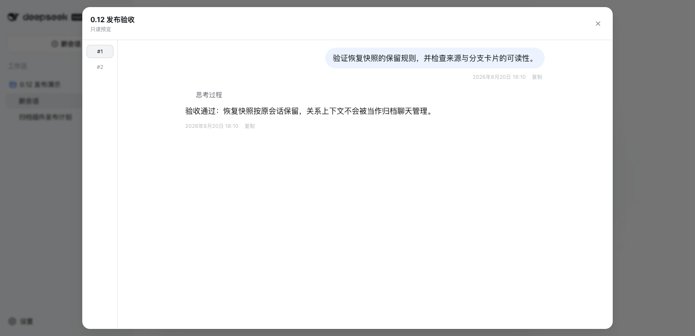</a>
  <a href="assets/screenshots/11-storage-retention.png">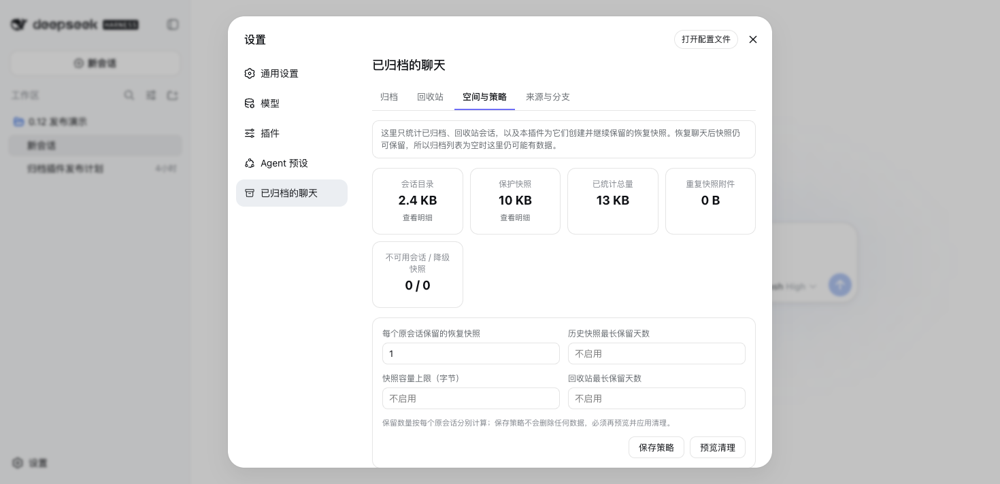</a>
</p>

<p align="center"><sub>无需先取消归档即可搜索和阅读；从本插件移除归档聊天时会先进入带恢复快照的回收站。</sub></p>

如果它帮你找回或保护过一次重要对话，欢迎给仓库一个 Star——这能帮助真正需要归档恢复功能的用户更容易发现它。

## 🚀 安装

```sh
dsh plugin --profile web add dsh-archived-chats@latest
```

安装后重启一次 DSH，然后打开 **设置 → 会话档案**。

更新已有安装：

```sh
dsh plugin --profile web update dsh-archived-chats
```

## 兼容性

1.0.0 已在 DeepSeek Harness `0.1.1-rc.2` Web profile 中验证能正常加载、注册 30 条路由并提供归档/历史读取边界。该 rc.2 Web Host 未公开导入与「恢复为副本」所需的持久层 writer，因此确认准备会返回 `501 restore-unsupported`且不写入数据；完整恢复需要宿主明确提供该公开能力。从 1.0 降级前请先备份 `$DSH_HOME/plugin-data/archived-chats/`；0.12 可继续校验、保留和清理 version 1 快照，但不会显示「历史版本」页签。

## 预览

以下截图是 `0.12.0` 界面基线，在隔离的真实 DeepSeek Harness `0.1.1-rc.2` 中文浅色 Web profile 中捕获，只使用合成演示会话，不包含真实用户数据。1.0 的「历史版本」界面尚未替换这组发布截图，因此下方仍保留原有路径和标题。

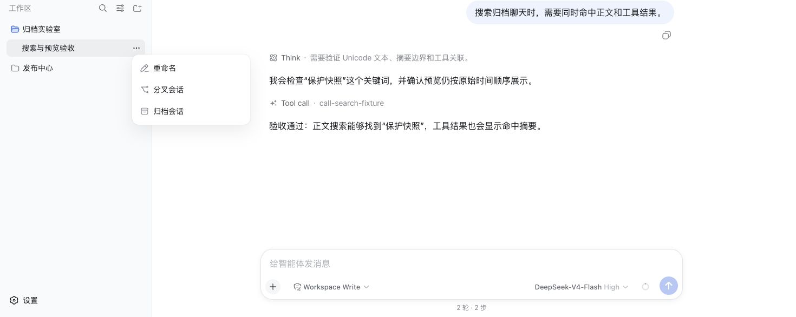
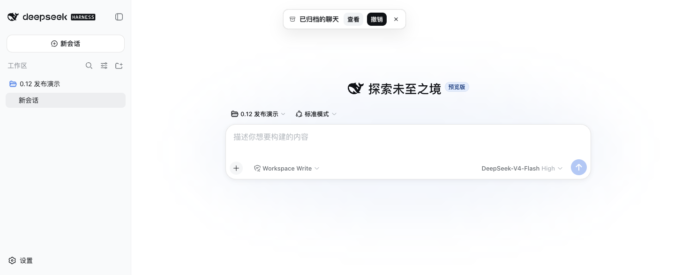
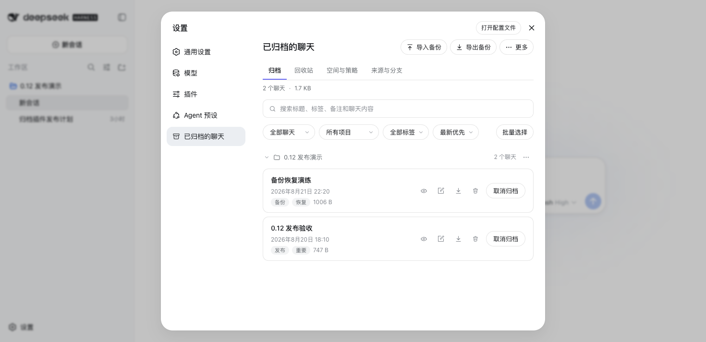
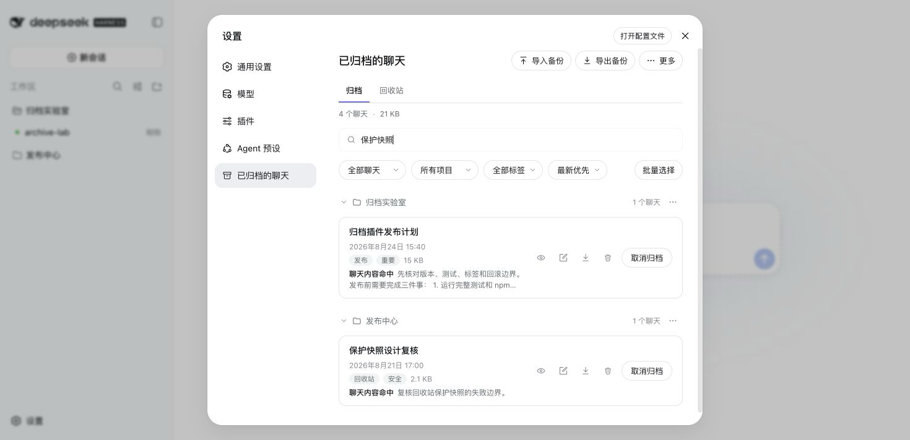

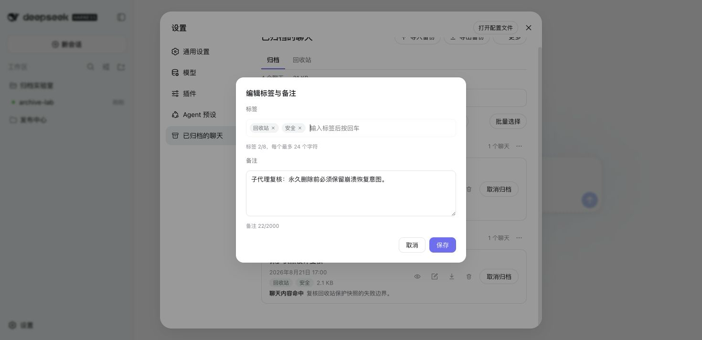
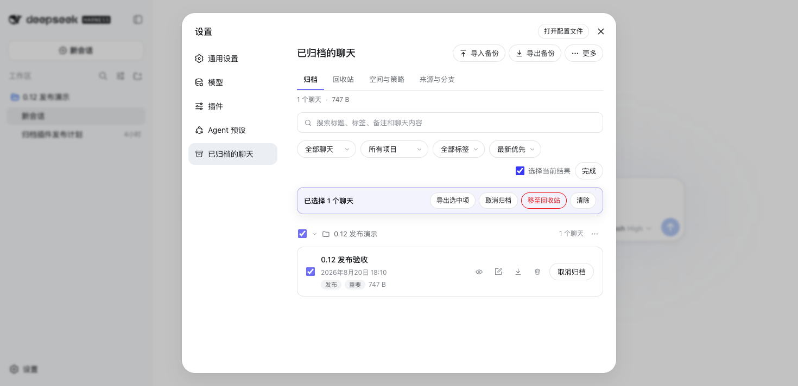
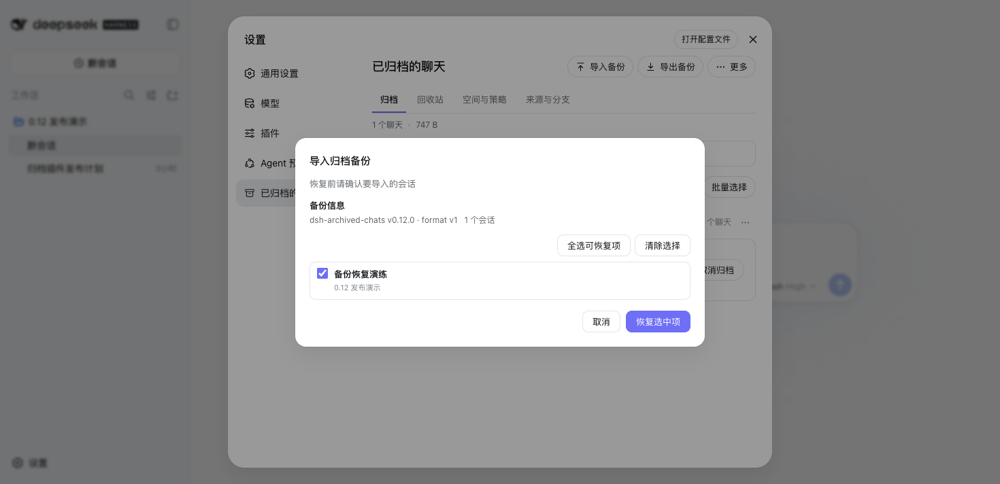
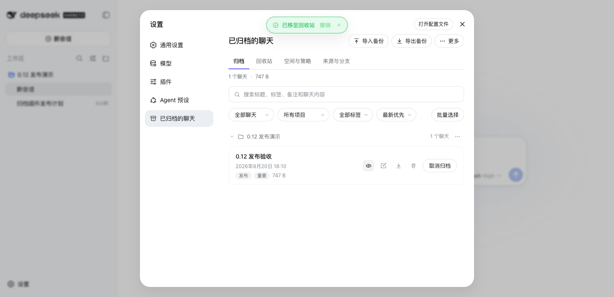
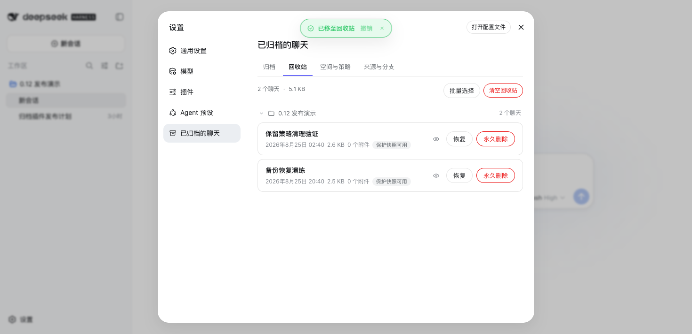
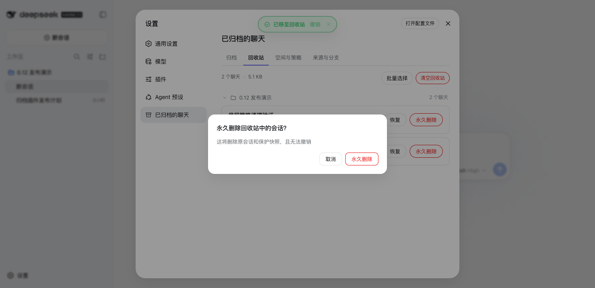

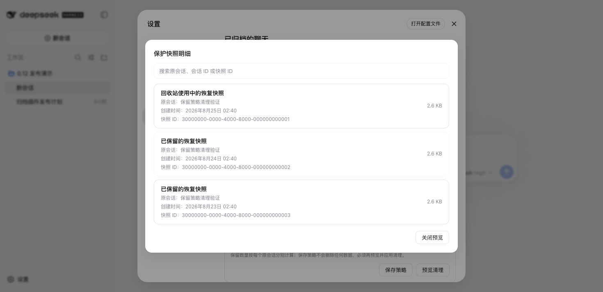
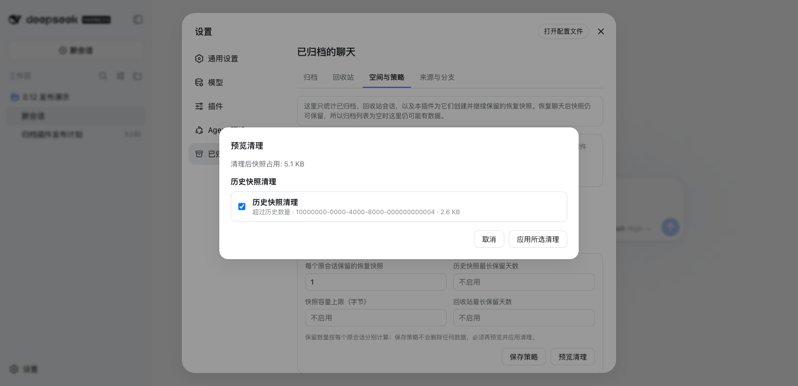
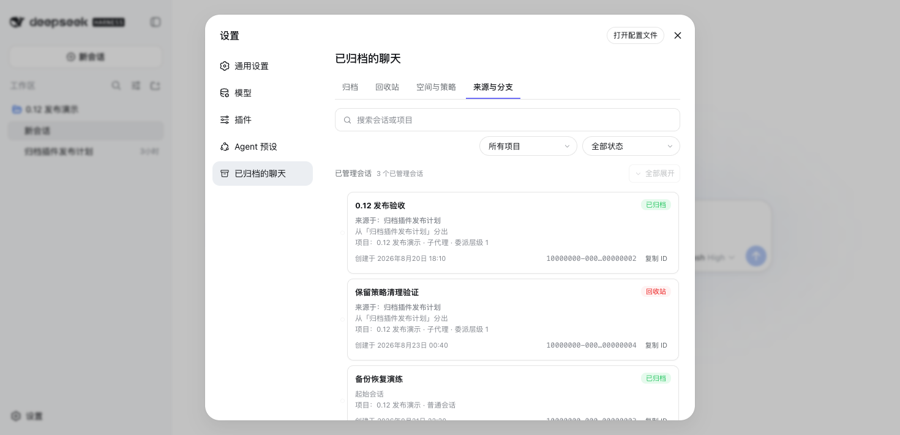

## 使用流程

1. 在 DSH 正常聊天的会话菜单中点击归档。宿主确认成功后，顶部提示会先显示「正在保存历史版本」，保存完成后才开始 3 秒关闭计时。快照失败不会回滚已成功的归档，提示会保留「重试保存」、**查看**、**撤销** 和关闭操作。
2. 打开 **设置 → 会话档案 → 历史版本**。这里按原会话分组，可搜索安全标题/项目，展开后可只读预览任意健康版本，或选择 **恢复为副本**。恢复由 Host 生成新会话 ID，始终作为已归档副本，不覆盖、取消归档或删除来源。
3. 在 **归档** 页签按工作区管理会话，搜索标题、标签、备注、聊天正文或工具结果；行内预览无需先取消归档。
4. 使用顶部 **导入备份 / 导出备份** 管理 ZIP 备份；ZIP 导入与历史恢复是两条独立流程。
5. 点击 **取消归档** 将会话放回侧边栏；点击 **移至回收站** 会在同一修订已有健康快照时复用它，否则创建新的保护快照。只有回收站中的 **永久删除 / 清空回收站** 会不可撤销地移除原会话与该来源的全部已验证历史快照。
6. 打开 **空间与策略** 预览并明确应用历史数量、年龄、容量和回收站年龄策略。**来源与分支** 仍以只读分支树展示必要关系上下文。

## 功能

- **完整归档列表**：按工作区（项目）分组并显示每组数量；每个分组都可折叠/展开，状态按浏览器记忆。
- **归档成功提示**：会话归档成功后，在 DSH 全局浮层显示 3 秒的紧凑提示，提供 **查看**、**撤销** 和关闭操作；鼠标悬停或键盘聚焦会暂停计时，查看/撤销进行中不会自动消失，失败时保留重试入口。
- **归档后本地历史**：浏览器触发的普通归档成功后才抓取一个已验证版本；相同非空修订去重。不扫描无关活动会话，不在后台、定时器或启动时自动抓取。
- **历史时间线、恢复与删除**：第五个「历史版本」页签按原会话展示时间、大小、附件数和回收保护状态；预览只读，恢复始终生成新的已归档 ID。普通历史可经确认后单条删除或全局清空，删除后无法恢复；原聊天不受影响，回收站保护和降级快照会跳过。
- **聊天正文全文搜索**：同一个搜索框同时匹配标题、项目、标签、备注、用户消息、助手回答与工具结果，并在结果行显示命中摘要。
- **原生归档对话预览与轮次导航**：沿用 Harness 会话布局，用户消息靠右、助手消息靠左；以只读方式展示 Markdown、思考过程、工具活动、JSON、代码和可用的已存储图片，并保留可快速跳转的响应式轮次轨道。宿主缺少附件能力时只影响图片，其他预览内容仍可阅读。
- **筛选与排序**：用类型（全部 / 普通会话 / 子代理会话）、项目和标签筛选，并按最新、最早或标题排序。
- **标签与备注**：任意行打开编辑器即可添加最多 8 个标签（每个最多 24 个 Unicode 字符）和一条备注（最多 2,000 个 Unicode 字符）。每行渲染标签小徽章，超过 3 个折叠为 `+N`，标签筛选不区分大小写。
- **存储统计**：概览条显示归档数量、已统计总大小与无法统计的会话数；每行显示各自占用。统计不会跟随符号链接，无法读取的会话目录显示为「无法统计」而非让请求失败。
- **JSON + Markdown 备份**：可导出单条、当前选中项或全部归档会话。每个 ZIP 都包含带版本的清单、用于机器恢复的完整会话 JSON，以及方便阅读的 Markdown 对话稿。
- **预览后导入与恢复**：选择 ZIP 备份后先检查全部会话，默认选中无冲突 ID 的项目，确认后作为已归档聊天恢复。已有 ID 会跳过，绝不会覆盖。
- **紧凑顶部操作**：常用的 **导入备份** / **导出备份** 直接可用，低频危险操作收纳在 **更多**；页面专注于 DSH 归档管理，不常驻来源选择器或冗余菜单。
- **按需多选**：复选框默认隐藏，点击 **批量选择** 后才显示；可逐条选择、选择当前筛选结果或整个项目。选中后可一次导出、取消归档或移至回收站，隐藏在其他筛选结果中的选择不会丢失。
- **取消归档**单个聊天，或从分组的 `⋯` 菜单整组取消——恢复的聊天会立刻回到侧边栏。
- **五个归档管理视图**：归档、历史版本、回收站、空间与策略、来源与分支。历史页首次激活时才加载；回收站按原工作区分组并可独立折叠。
- **空间分析**：分别统计归档/回收会话目录与插件保护快照，标出无法统计项、降级快照和重复快照附件字节；会话目录与快照明细从摘要卡片进入可搜索弹窗，不会把保留策略持续向下推，也不会把这些数字描述为 Harness 全局附件可回收空间。
- **预览优先的保留策略**：可按每个原会话的保留快照数、快照年龄、快照容量和回收站年龄生成候选；默认每个原会话保留一份恢复快照。保存策略绝不自动执行，回收站正在使用或不可用的快照不会被选中，回收站永久删除默认不勾选。
- **只读来源与分支**：使用 Harness 持久化 `parentSession` 展示已归档/回收站会话的来源、分叉和子代理树，并保留解释关系所需的父子上下文；无关活动会话不会发送到浏览器。管理卡片把来源说明放在卡片内容中，底部独立一排居中显示折叠箭头；可复制完整 ID、点击整张卡片或箭头折叠，使用项目/状态筛选和全局展开/折叠。搜索标题、项目或 ID 时会自动展开命中路径，独立滚动区域避免大树持续推长页面，超过 50 个节点时根分支默认折叠。本版只诊断缺失父节点、循环与委派深度不一致，不修改关系。
- **自动恢复快照与保留历史**：已归档聊天移入回收站前保存完整会话事件和经校验的图片附件字节。恢复只移除回收记录，不自动删除快照；它会显示为“已保留的恢复快照”，即使当前没有归档聊天。重复恢复/回收会继续保留旧的有效快照，直到用户明确应用保留策略或永久删除该会话。
- **两级恢复**：原会话仍完好时只移除回收标记，不重写持久层；原件丢失时才使用已验证快照和官方写入能力回退恢复，且绝不覆盖同 ID 会话。
- **明确的永久删除**：仅回收站提供永久删除与清空。插件先写入 `purge-pending` 崩溃恢复意图，再删除原会话和保护快照；中途失败会在下次启动重试。
- 适配浅色/深色主题，支持中文和英文界面。

## 回收站、隐私与附件限制

回收目录 `trash.json` 与历史/保护快照位于 `$DSH_HOME/plugin-data/archived-chats/`，全部只保存在本机。快照会逐个读取附件、校验摘要并使用原子发布；不会上传、云同步或定时扫描会话与附件。

保留策略保存在同目录的 `retention.json`。插件不会在后台、启动时或定时自动应用策略；每次清理都要先生成五分钟有效的单次预览，再由用户选择并确认。

回收站永久删除会删掉该来源的全部已验证快照附件副本，但 Harness 全局附件存储可能仍因其他会话引用或宿主垃圾回收策略保留相同字节；本插件不声称会立即清理宿主的全局附件库。

## 标签、备注与统计

标签和备注**只保存在本机**的 `$DSH_HOME/plugin-data/archived-chats/metadata.json` 中——不会被上传、同步或发送到任何其他地方。取消归档会保留元数据；物理删除完成后会移除它，而延后或失败的删除会保留它。元数据与统计失败永远不阻塞：即使元数据存储无法读取或某个会话目录无法统计，列表、取消归档和删除仍然可用。

## 导出与备份

导出只会触发本地浏览器下载。单条和批量使用同一种 ZIP 格式：

```text
manifest.json
sessions/001-<安全标题>-<id>/session.json
sessions/001-<安全标题>-<id>/transcript.md
```

`session.json` 是权威备份记录：原样保存 Harness 持久层返回的完整元数据和事件，并附带归档标题、工作区、时间、来源、标签、备注和存储统计。`transcript.md` 是通过 Harness 官方消息投影生成的可读副本。ZIP 路径会净化并处理重名，批量导出逐个会话生成，不会同时把所有会话内容堆进内存。

JSON 会保留附件引用，但**本版不复制附件二进制，也不包含子会话**。需要带完整附件的会话树时，请使用 Harness 官方的 Session log 导出。

## 导入与恢复

导入只接受本插件版本一的导出 ZIP。浏览器会先上传并进行有界校验，然后展示标题、项目、标签、备注、存储信息、ID 冲突、项目不存在警告和附件引用警告；预览不会渲染原始事件或 Markdown。已有会话 ID 会被禁用并跳过，找不到的项目会恢复为未分组。确认令牌 10 分钟后过期且只能使用一次。标签和备注通过现有本地元数据限制恢复，不会恢复附件二进制。宿主没有可用的 Harness 写入能力时返回 `restore-unsupported`，不会写入任何数据。

## 常见问题

<details>
<summary><b>归档会删除聊天吗？</b></summary>

不会。DSH 只是把聊天从侧边栏隐藏，并保留归档会话记录。这个插件提供设置页，用来查找、导出、恢复、取消归档或删除这些记录。

</details>

<details>
<summary><b>历史版本是界面截图吗？恢复会覆盖原聊天吗？</b></summary>

不是。它们是插件在本机保存并校验的会话记录与附件副本，预览只读。**恢复为副本** 会请 Host 生成新 ID，创建新的已归档聊天；来源会话和所选快照均不会被覆盖、删除或取消归档。

</details>

<details>
<summary><b>导入备份包含已存在的会话 ID 时会怎样？</b></summary>

冲突行会在预览中明确标记，默认禁用并跳过。导入流程绝不会覆盖已有会话。

</details>

<details>
<summary><b>ZIP 备份包含附件吗？</b></summary>

`session.json` 会保留附件引用，但不会包含附件二进制或子会话。需要完整附件会话树时，请使用 Harness 官方 Session log 导出。

</details>

<details>
<summary><b>移入回收站后可以马上恢复吗？</b></summary>

可以。完成移入后的提示会提供 **撤销**，回收站中也可随时恢复。运行中会话会先按宿主生命周期安全停用或停放，然后才提交回收记录；如果宿主能力不足，操作会明确失败并保留归档会话。

</details>

<details>
<summary><b>为什么没有已归档聊天，空间页仍显示恢复快照？</b></summary>

恢复快照是在已归档聊天移入回收站前创建的。恢复聊天时插件会移除回收记录，但故意保留已经验证的快照作为恢复历史，因此当前归档列表为空时仍可能占用空间。可在「历史版本」中单条删除或使用「清空历史版本」；回收站正在使用的保护版本会跳过。也可将保留数量改为 `0`，再执行 **预览清理 → 应用所选清理**。

</details>

## 实现概览

插件由两部分组成：Host 服务层负责读取本地归档、版本快照、回收目录和恢复/清除事务，浏览器设置页负责搜索、历史时间线、只读预览、备份、恢复为副本与明确确认。所有修改都通过受保护的本地路由完成；普通移除只提交回收记录，物理清除仅由回收站的崩溃安全 purge 流程触发。

普通用户需要了解的数据保存、备份限制、删除结果和兼容性说明已列在本 README 中。路由清单、数据流、恢复事务、实时删除生命周期和失败回退等维护者细节请参阅 [架构文档](docs/ARCHITECTURE.md)。

## 开发

```sh
npm test
```

测试套件（`test/*.test.mjs`）覆盖导出与导入、历史抓取/清单/预览/图片授权、单次确认的恢复为副本事务、回滚、保留策略、全文搜索，以及 Host+浏览器冒烟/响应式行为。测试使用隔离的临时 DSH 主目录和模拟运行时，不会读取或修改真实会话。

## 版本更新记录

### 1.0.0

- 新增第五个 **历史版本** 页签：按原会话查看本地已验证版本、回收保护状态和不透明降级项。
- 浏览器归档成功后按稳定修订去重抓取；失败不回滚归档，通知保留安全重试。
- 复用原有对话预览显示快照时间与已验证图片；恢复始终生成新的已归档 ID，不覆盖来源。
- 新增经过危险确认的单条历史删除和全局清空；不使用复选框，回收站保护/降级快照不会被该操作删除。
- 回收移动可复用相同非空修订快照；保留策略继续治理历史，永久删除会清掉该来源的全部已验证快照。
- 真实 `0.1.1-rc.2` Web Host 验证了插件加载、安全清单与能力降级；宿主缺少 writer 时恢复以 `restore-unsupported` 无写入失败。
- **降级提醒：** 0.12 不显示「历史版本」页签，但仍能校验、保留和清理 version 1 快照。降级前仍应备份 `$DSH_HOME/plugin-data/archived-chats/`。

### 0.12.0

- 归档成功后新增 3 秒顶部提示，可立即查看归档中心或撤销；悬停/聚焦暂停，操作失败保留重试。
- 新增会话目录与保护快照分账、重复快照附件统计和不可用/降级诊断。
- 新增按历史数、年龄与容量规划的保留策略；保存与执行分离，清理使用单次短效预览并在执行前重检。
- 新增只读“来源与分支”树，只展示已归档/回收站会话和必要关系上下文，并诊断缺失父节点、循环和委派深度异常。
- 重复回收周期不再立即删除上一份有效保护快照；永久删除仍通过 `purge-pending` 事务移除原会话和全部有效快照。
- **降级提醒：** 0.11.x 不显示或治理多份历史快照，但能容忍它们并在永久删除时清理。降级前请备份 `$DSH_HOME/plugin-data/archived-chats/`。

### 0.11.0

- 新增 **归档 / 回收站** 双标签、独立批量选择、回收站范围预览、恢复、永久删除和清空。
- 普通删除改为创建完整本地保护快照并移入回收站，成功后可立即 **撤销**。
- 恢复优先使用完好原会话；原件丢失时改用已校验的会话+附件快照，不覆盖同 ID 会话。
- 新增 `purge-pending` 崩溃恢复意图、快照恢复扫描、降级状态，并将旧版 `pending-deletions.json` 安全迁移为可恢复回收记录，不在启动时静默删除。
- **降级警告**：安装 0.11 后如回退到 0.10，旧版不会识别回收目录和保护快照；回退前请先在 0.11 恢复需要的会话并备份 `$DSH_HOME/plugin-data/archived-chats/`。

### 0.10.0

- 新增遵循 Harness 会话布局的归档对话预览：用户消息靠右，助手消息靠左，并支持分页与响应式轮次导航。
- Markdown、思考过程、工具活动、JSON、代码和可用的已存储图片均以只读方式呈现；宿主缺少附件能力时只影响图片，不影响其余对话内容。
- 新增归档聊天正文全文搜索：匹配 Unicode 文本和工具结果，在原有标题/标签/备注筛选上合并命中结果。
- 搜索与预览使用受保护的本地 POST 路由、有界请求、并发 4 的读取、部分失败降级和有上限的 TTL/LRU 内存缓存。

### 0.9.0

- 新增按需显示的批量选择模式：列表默认不展示复选框，点击入口后才显示，完成批量操作后自动退出。
- 将常用 ZIP 备份操作改为直接的 **导入备份 / 导出备份**，危险操作收纳到 **更多**，精简页头布局。
- 移除未提供原生继续能力的跨工具 JSONL 迁移入口，让插件专注于 DSH 已归档聊天管理。
- 在 DeepSeek Harness `0.1.0-rc.8` 真实宿主中复核新控件、备份预览和标题单行布局。

### 0.8.1

- 将中文 README 设为仓库和 npm 包的默认入口，英文文档改为 `README.en.md`。
- 将维护者架构、路由、恢复事务和删除生命周期细节移到 `docs/ARCHITECTURE.md` 与 `docs/ARCHITECTURE.en.md`。
- 安装章节增加快速识别用的 🚀 图标；插件运行时行为保持与 0.8.0 一致。

### 0.8.0

- 新增版本一 ZIP 备份的预览后导入。
- 新增不会覆盖已有会话的冲突安全恢复和事务式写入。
- 新增工作区/附件警告、有界校验、一次性确认令牌和元数据恢复。

### 0.7.0

- 新增单条、选中项和全部归档会话的带版本 JSON + Markdown ZIP 备份。
- 新增流式导出、安全 ZIP 路径、清单记录和官方消息投影生成的 Markdown 对话稿。

### 0.6.0

- 新增标签、备注、存储统计、元数据持久化和归档洞察界面。
- 加固仍在运行会话的删除流程，并为不提供内部生命周期接口的宿主增加回退处理。

### 0.5.1

- 发布面向 DeepSeek Harness `0.1.0-rc.7` 的兼容性修订版本。
- 更新浏览器设置区块，使用 rc.7 的浮层和状态设计令牌。

### 0.5.0

- 新增多选以及批量取消归档/删除流程。
- 改进破坏性操作后的焦点恢复和项目范围选择行为。

### 0.4.0

- 在宿主提供所需生命周期接口时，新增仍在运行会话的原地删除。
- 新增安全的待删队列回退、标题缓存，以及破坏性操作完成后的成功提示。

### 0.3.0

- 首个公开发布版本，提供「会话档案」设置页。
- 新增按工作区分组浏览、标题搜索、类型/项目筛选、取消归档，以及带确认的单条/分组/全部删除。
- 新增 Host 路由、浏览器设置区块，以及用于处理运行中会话的待删队列清扫。

### 0.1.0 和 0.2.0

- 这两个版本从未发布到 npm，也没有对应的仓库标签；`0.3.0` 是首个公开版本。

## 卸载

```sh
dsh plugin --profile web remove dsh-archived-chats
```

卸载不会删除 `$DSH_HOME/plugin-data/archived-chats/` 中的 `metadata.json`、`trash.json`、`retention.json`、保护快照或旧版 `pending-deletions.json`，也不会触发永久删除。这是故意的本地数据保护；请先恢复或备份需要的会话，再手动处理该目录。

## License

MIT
