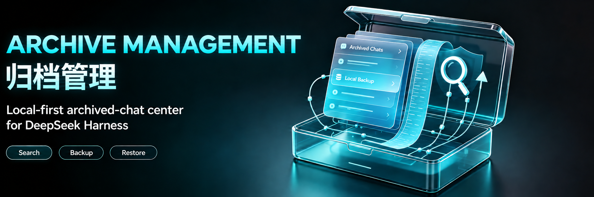

[](https://dsh-insights.com/p/Ultronen/dsh-archived-chats/)

<p align="center">
  
</p>

<div align="center">

<h1>Archive Management</h1>

<p><strong>A local-first archived-chat center for DeepSeek Harness</strong></p>
<p><code>dsh-archived-chats</code></p>

<p>
  <a href="https://www.npmjs.com/package/dsh-archived-chats"></a>
  <a href="https://www.npmjs.com/package/dsh-archived-chats"></a>
  <a href="https://github.com/Ultronen/dsh-archived-chats/actions/workflows/ci.yml"></a>
  <a href="https://github.com/Ultronen/dsh-archived-chats/actions/workflows/ci.yml"></a>
</p>
<p>
  <a href="https://github.com/Ultronen/dsh-archived-chats/blob/main/LICENSE"></a>
  <a href="https://awesome-dsh-plugin.com/p/Ultronen/dsh-archived-chats/"></a>
  <a href="https://github.com/Ultronen/dsh-archived-chats/stargazers"></a>
</p>

<p>English · <a href="README.zh-CN.md">简体中文</a></p>
<p><a href="https://awesome-dsh-plugin.com/p/Ultronen/dsh-archived-chats/">Plugin market</a> · <a href="https://www.npmjs.com/package/dsh-archived-chats">npm</a> · <a href="https://github.com/Ultronen/dsh-archived-chats/releases">Releases</a> · <a href="https://github.com/Ultronen/dsh-archived-chats/discussions">Discussions</a> · <a href="https://github.com/Ultronen/dsh-archived-chats/security/advisories/new">Private security report</a></p>

</div>

Archive Management gives DeepSeek Harness a place to find chats hidden from the main chat area after archiving. It keeps DSH's single-chat archive workflow and adds workspace bulk archiving, search, preview, backup, and a workspace-based Recycle Bin workflow.

> The English name is **Archive Management**, and the Chinese name is **归档管理**. The installation package remains `dsh-archived-chats`.
>
> This document follows the `main` branch. This guide targets 1.4.1, including the English rename and feedback improvements. Installed users should check the version differences in the upgrade notes. See the [changelog](CHANGELOG.md) for release history.

## Quick start

Search for `dsh-archived-chats` in DSH's plugin market, verify the author is **Ultronen**, and choose **Install**. After installation, follow the host's restart instructions. The settings entry is **归档管理** in Chinese; in English it is **Archive Management**.

Alternatively, run this command on the computer running DSH:

```sh
dsh plugin --profile web add dsh-archived-chats@latest
```

Restart DSH, then open **Settings → Archive Management** (Chinese: **设置 → 归档管理**).

Before updating an older installation, read “Upgrading from older releases” below. To update:

```sh
dsh plugin --profile web update dsh-archived-chats
```

## What it does

| Area | Current behavior |
| --- | --- |
| Browse and search | Workspace-grouped archived chats, full-text search, filters, sorting, tags, and notes. |
| Workspace archiving | A settings-owned workspace chooser supports one or more workspaces and one aggregate confirmation; blank, active, or unreadable chats are skipped. |
| Read-only preview | Conversations, reasoning, tool activity, Markdown, JSON, code, and readable stored images without unarchiving. |
| Backup | Export one workspace or the entire archive as JSON + Markdown ZIP; preview imports and skip conflicting IDs. |
| Recycle Bin | Move archived chats by workspace; restore one chat, a workspace, or the entire Recycle Bin back to Archived. |
| Permanent deletion | Delete one archived chat, a workspace's archive, or all archived chats after confirmation. Recycle Bin deletion is separate. |
| Storage and relationships | Storage accounting, optional automatic Recycle Bin cleanup, and read-only Origins & Branches. |

The five views are **Archived**, **Recycle Bin**, **Storage & Retention**, **Origins & Branches**, and **About**. Archiving does not create historical versions; Recycle Bin protection snapshots support recovery, not a browsable version-history library.

The Archived header has **Bulk archive** and **More**. More contains Import backup, Export all, Unarchive all, then Delete all after a separator. The Recycle Bin header directly shows **Restore all** and **Empty Recycle Bin** without a More menu. Recycle rows retain the preview icon and use compact **Restore** and **Delete** text buttons. Workspace and global restoration separately confirm scope, counts, and the Archived destination, skipping pending deletions. Empty Recycle Bin still requires irreversible-action confirmation. The header keeps consistent dimensions across tabs. Workspace actions and global export, unarchive, and deletion ask you to confirm the complete archive scope and chat count.

**About** shows the running version, author, license, guides, project and feedback links, and Check for updates. Opening the page checks public npm version metadata in the background, at most once every 12 hours during a running backend session; failures never block archive management. A newer version adds a **Get update** link beside the title, opening the plugin market without installing or restarting anything. Follow the host's restart guidance when convenient; a browser refresh alone may not load an updated backend. No chat or backup content is sent during update checks.

Preview keeps real user messages on the right and the assistant's work on the left. Fully loaded, completed turns group intermediate work into a collapsed process disclosure, with the final response outside it. Partial turns remain in event order. After updating, reload the DSH backend to use the new preview projection; refreshing the browser alone is insufficient.

## Archive, recycle, or delete?

- **Archive:** retain a chat outside the main chat area. Unarchive returns it there.
- **Move to Recycle Bin:** available only through an archived workspace's menu. Recovery returns the chat to Archived; Unarchive then returns it to the main chat area.
- **Delete all on Archived:** permanently delete archived chats across all workspaces, not existing Recycle Bin entries.
- **Empty Recycle Bin:** permanently delete recycled chats and their associated protection data.

There is no row-level Recycle Bin move or single-chat export. Workspace and global actions include chats hidden by filters. Workspace actions do not delete workspace/project directories. See the [action scope table](docs/USER_GUIDE.md#actions-and-their-scope) before bulk operations.

Empty Recycle Bin acts only on the exact recycle-record incarnations shown at confirmation. Records added afterward are excluded; a changed target fails instead of widening the confirmed scope. A chat without a working directory remains in Archived because this Host cannot make it reachable from the main chat list; a missing workspace alone can still restore as ungrouped.

## Data safety and limits

- **Local only:** plugin state lives under `$DSH_HOME/plugin-data/archived-chats/`; the plugin does not upload or cloud-sync chats. Update checks request only public npm version metadata, without chat or backup content.
- **Recovery before purge:** workspace Recycle Bin moves require a healthy protection snapshot. Direct permanent deletion does not create a recoverable copy.
- **No overwrite:** imports skip existing IDs. Recycle recovery prefers the original; snapshot fallback recreates an ordinary session ID only through an explicitly exclusive Host writer and otherwise retains the recovery record.
- **Durable deletion:** confirmed deletion tasks clean related snapshots before the original. Partial failures retain non-restorable tasks for retries while running or after restart.
- **Automatic Recycle Bin cleanup is off by default:** enabling or shortening retention requires confirmation. It applies to expired recycled chats, not ordinary archived chats.
- **ZIP is not an attachment-complete backup:** attachment references remain, but attachment bytes and automatic descendant-session bundling are excluded.

Successful exports are validated against the same format and budgets as import before the download starts. The browser buffers a validated ZIP with a five-minute timeout and 320 MiB response cap; this limits response bytes, not peak browser memory. “Backup download started” does not mean the browser has saved the file to disk.

## Upgrading from older releases

**Names and versions:** Version 1.4.1 uses Archive Management; 1.4.0 labels its English menu Session Archive. Both correspond to **归档管理** in Chinese and are the same plugin. The Chinese entry, package name, install command, and data location are unchanged. Update to 1.4.1 or later and restart DSH to load the renamed English entry.

The standalone History and cleanup-preview interfaces have been removed; do not use older screenshots to locate them.

**Startup recovery removes old snapshots that are not referenced by current recycle records, including plugin-owned attachment copies. They are not placed in the Recycle Bin. This cleanup is independent of the optional Recycle Bin retention setting.**

Referenced protection snapshots are kept. Removing an unreferenced snapshot does not delete its source chat; already-confirmed deletion retries and enabled retention cleanup are separate operations.

If old snapshot content is still needed, recover/export it using a supporting older version before updating, preserve required attachments separately, or make an offline backup of the full plugin-data directory. Before downgrading, finish pending deletion tasks and back up data; older releases may not understand snapshotless pending-deletion records.

## Compatibility

The package declares DSH `>=0.1.0-rc.7`; individual features depend on public Host capabilities.

| Host capability | Dependency or limitation |
| --- | --- |
| Public archive API | Required for workspace bulk archiving; unsupported requests make no changes. |
| Session and attachment reads | Used by preview/search; unavailable attachment reads degrade images only. |
| Session-scoped physical location | Required for session-directory accounting and permanent deletion; shared directories are never used as purge targets. |
| Public writer | Required for ZIP import and snapshot fallback; restoring an intact original does not rewrite its log. Plain legacy create/append is not enough for safe ZIP restore unless the provider explicitly guarantees exclusive creation. |
| Modern handles | Fork titles, preview/search, and Recycle Bin moves are supported. ZIP v2 preserves inherited boundaries; import uses create/append/flush/close and a safe session-scoped rollback location. Ordinary v1 ZIPs remain readable, but ambiguous seeded v1 sources are refused rather than flattened. |

Recycle Bin preview still depends on the original session; a missing original may prevent preview even when a protection snapshot can restore it. See [compatibility and limits](docs/USER_GUIDE.md#compatibility-and-limits).

The declared range remains capability-based. Release automation passed Node.js 18 on Ubuntu and Node.js 24 on Ubuntu, macOS, and Windows; the Node.js 24 matrix required the official Host backend integration (5/5) and package checks. The installed 1.4.0 artifact also passed the official native round trip (5/5) against `@deepseek-ai/dsh-session@0.1.5-rc.2`.

## Documentation

| Resource | English | 简体中文 |
| --- | --- | --- |
| User guide | [Read the guide](docs/USER_GUIDE.md) | [查看指南](docs/USER_GUIDE.zh-CN.md) |
| Architecture | [Maintainer architecture](docs/ARCHITECTURE.en.md) | [维护者架构](docs/ARCHITECTURE.md) |
| Release history | [GitHub Releases](https://github.com/Ultronen/dsh-archived-chats/releases) | [GitHub Releases](https://github.com/Ultronen/dsh-archived-chats/releases) |

See also [Support](SUPPORT.md), [Security](SECURITY.md), [Contributing](CONTRIBUTING.md), [Code of Conduct](CODE_OF_CONDUCT.md), and [Discussions](https://github.com/Ultronen/dsh-archived-chats/discussions). Before claiming work or opening a pull request, contributors must read the [Contributing Guide](CONTRIBUTING.md) in full.

## Project status

Archive Management is actively maintained. The latest stable npm release receives fixes and security updates; older releases should be upgraded before reporting a problem. Reproducible bug reports and focused pull requests are welcome. Accepted community tasks are marked [`help wanted`](https://github.com/Ultronen/dsh-archived-chats/issues?q=is%3Aissue+is%3Aopen+label%3A%22help+wanted%22); read the [claim workflow](CONTRIBUTING.md#community-proposals-and-claims) before starting substantial work. Maintenance is performed as availability permits, so no fixed response or release schedule is promised.

## Development

```sh
npm test
npm pack --dry-run --json
```

The suite covers Host and browser behavior, export/import, snapshot fallback recovery, Recycle Bin, retention, search, responsive layout, public types, package contents, and repository hygiene. It uses isolated temporary data and never reads real sessions.

## Uninstall

```sh
dsh plugin --profile web remove dsh-archived-chats
```

Uninstalling removes only the plugin package and preserves `$DSH_HOME/plugin-data/archived-chats/`; it does not run a permanent purge. Reinstallation follows the installed version's startup recovery and cleanup rules, including unreferenced-snapshot cleanup. Back up needed data before uninstalling or manually removing plugin state. See [local data and uninstall](docs/USER_GUIDE.md#local-data-and-uninstall).

## License

[MIT](LICENSE)
