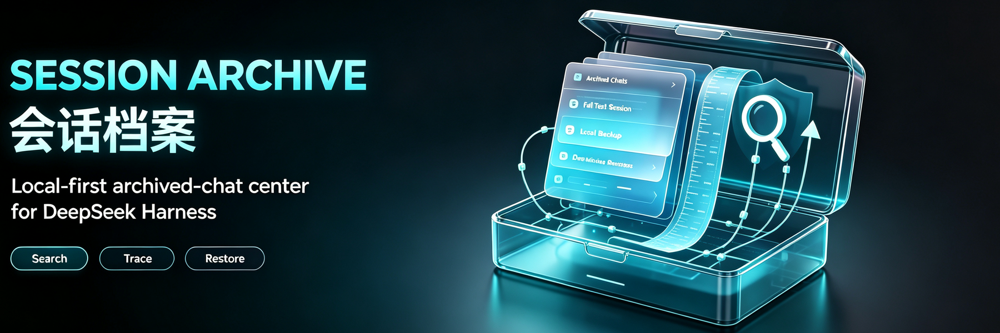

<p align="center">
  
</p>

<div align="center">

<h1>会话档案</h1>

<p><strong>面向 DeepSeek Harness 的本地优先归档聊天中心</strong></p>
<p><code>dsh-archived-chats</code></p>

<p>
  <a href="https://www.npmjs.com/package/dsh-archived-chats"></a>
  <a href="https://www.npmjs.com/package/dsh-archived-chats"></a>
  <a href="https://github.com/Ultronen/dsh-archived-chats/actions/workflows/ci.yml"></a>
  <a href="https://github.com/Ultronen/dsh-archived-chats/actions/workflows/ci.yml"></a>
</p>
<p>
  <a href="https://github.com/Ultronen/dsh-archived-chats/blob/main/LICENSE"></a>
  <a href="https://awesome-dsh-plugin.com/p/Ultronen/dsh-archived-chats/"></a>
  <a href="https://github.com/Ultronen/dsh-archived-chats/stargazers"></a>
</p>

<p><a href="README.md">English</a> · 简体中文</p>
<p><a href="https://awesome-dsh-plugin.com/p/Ultronen/dsh-archived-chats/">插件市场</a> · <a href="https://www.npmjs.com/package/dsh-archived-chats">npm</a> · <a href="https://github.com/Ultronen/dsh-archived-chats/releases">版本发布</a> · <a href="https://github.com/Ultronen/dsh-archived-chats/discussions">问题交流</a> · <a href="https://github.com/Ultronen/dsh-archived-chats/security/advisories/new">私密报告漏洞</a></p>

</div>

会话档案为 DeepSeek Harness 中归档后从侧边栏消失的聊天提供统一入口。你可以按工作区浏览全部归档聊天、全文搜索对话、从回收站恢复已删除的聊天，并通过明确且可恢复的流程恢复或删除它们。

> 原「已归档的聊天」现已更名为「会话档案 / Session Archive」。包名、仓库、安装命令和本地数据位置均未改变，现有用户无需迁移数据。

## 快速开始

```sh
dsh plugin --profile web add dsh-archived-chats@latest
```

安装后重启一次 DSH，然后打开 **设置 → 会话档案**。

更新已有安装：

```sh
dsh plugin --profile web update dsh-archived-chats
```

<p align="center">
  <a href="assets/screenshots/preview-03.png"></a>
  <a href="assets/screenshots/preview-07.png"></a>
</p>

## 核心能力

| 范围 | 提供的能力 |
| --- | --- |
| **浏览与搜索** | 按工作区浏览归档聊天，全文搜索消息和工具结果，并支持筛选、排序、标签与备注。 |
| **归档整个工作区** | 从 **设置 → 会话档案** 打开工作区选择器，再用一次确认归档其中全部符合条件的聊天；空白的新会话窗口不会计入，工作区及其目录保持不变。 |
| **原生只读预览** | 以原生对话布局展示 Markdown、思考过程、工具活动、JSON、代码和可用的已存储图片，并提供响应式轮次导航。 |
| **已有快照** | 已有快照直接显示在 **回收站**，支持只读预览、恢复为新的归档副本或确认永久删除；归档不再生成版本。 |
| **备份与恢复** | 导出 JSON + Markdown ZIP，并通过预览优先、冲突安全的流程导入；已有会话 ID 永不覆盖。 |
| **可恢复删除** | 带保护快照的回收站支持立即撤销、两级恢复，以及单独确认的永久删除。 |
| **空间与关系** | 空间分账、可选的回收站自动清理，以及用于分叉和子代理树的只读「来源与分支」。 |

四个主视图为 **已归档**、**回收站**、**空间与策略** 和 **来源与分支**。升级会保留已有快照并统一放入回收站；独立历史版本入口与归档时自动抓取已取消。

## 安全设计

- **数据只在本机：** 插件元数据、回收记录、策略和已验证快照均保存在 `$DSH_HOME/plugin-data/archived-chats/`，不会上传或云同步。
- **不静默覆盖：** 导入和快照恢复只创建或选择无冲突 ID，绝不覆盖已有会话。
- **删除必须明确：** 普通移除会在快照保护后进入回收站；只有经过确认的永久删除操作才会物理清除。
- **可选自动清理：** 默认关闭，确认保留期限后，DSH 运行时自动永久删除到期的回收聊天，启动后补清理。开启或缩短期限会先列出受影响聊天供确认；旧版设置不会自动开启。
- **确认工作区归档：** 选择器只显示有可归档会话的工作区，支持单选、多选和可再次点击取消的“全选”，并统一从右下角“确定”继续。插件在后台分别准备精确集合，跳过准备期间变为空的工作区，再显示一次汇总确认。只有检查到真实 `turn/start` 的会话才符合条件；空白的新会话窗口及无法确认内容的会话都会跳过。每个工作区保留独立的 5 分钟单次凭据，不会纳入之后新建的聊天；运行中的聊天只会跳过，绝不停止或移动。
- **备份范围清楚：** ZIP 保留完整会话 JSON 和可读 Markdown，但不包含附件二进制或后代会话。

## 兼容性

插件根据 DeepSeek Harness Host 暴露的公开能力启用功能，不绑定固定 Host 版本。

| Host 能力 | 插件行为 |
| --- | --- |
| 归档与会话读取 | 浏览、搜索、预览、回收站中的保护快照清单、空间分账和会话血缘。 |
| `settings.section` + 公开 `archiveSession` | 插件自己的设置页提供仅展示可归档项的多工作区选择器和一次汇总确认，不依赖工作区菜单扩展 slot；缺少归档能力时，准备请求返回 `workspace-archive-unsupported`，且不作任何修改。 |
| 附件读取 | 对话和快照预览可显示已存储图片；缺少时文本内容仍可阅读。 |
| 会话独立日志位置 | 回收站永久删除使用持久化后端公开的 `locate(meta)` 能力。后端不提供会话独立位置时不支持永久删除；失败的条目保留在列表中并显示具体原因。 |
| 公开会话 writer | ZIP 导入、快照恢复和原件丢失时的快照回退，都通过 Host 公开的 `create` / `append` / `locate` 能力写入；Host 提供专用恢复入口时优先使用。 |
| 缺少写入能力 | 操作返回 `restore-unsupported`，不会写入或覆盖数据。 |

降级到不识别统一回收站或新版快照状态的版本前，请备份 `$DSH_HOME/plugin-data/archived-chats/`。

## 演示预览

下列固定 8 张图片来自隔离的简体中文浅色 Web 环境和合成会话，不包含真实用户数据、路径、备注或凭据；其文件与顺序和插件市场声明完全一致。

<details>
<summary><strong>查看全部 8 张演示图</strong></summary>
<br>
<table>
  <tr>
    <td><br><sub>归档总览</sub></td>
    <td><br><sub>全文搜索</sub></td>
  </tr>
  <tr>
    <td><br><sub>工作区归档选择器</sub></td>
    <td><br><sub>原生只读预览</sub></td>
  </tr>
  <tr>
    <td><br><sub>统一回收站</sub></td>
    <td><br><sub>清空回收站确认</sub></td>
  </tr>
  <tr>
    <td><br><sub>自动清理确认</sub></td>
    <td><br><sub>来源与分支</sub></td>
  </tr>
</table>
</details>

## 文档

| 资料 | English | 简体中文 |
| --- | --- | --- |
| 用户指南 | [Read the guide](docs/USER_GUIDE.md) | [查看指南](docs/USER_GUIDE.zh-CN.md) |
| 架构说明 | [Maintainer architecture](docs/ARCHITECTURE.en.md) | [维护者架构](docs/ARCHITECTURE.md) |
| 版本历史 | [GitHub Releases](https://github.com/Ultronen/dsh-archived-chats/releases) | [GitHub Releases](https://github.com/Ultronen/dsh-archived-chats/releases) |

另见 [支持说明](SUPPORT.md)、[安全说明](SECURITY.md)、[贡献指南](CONTRIBUTING.md)、[行为准则](CODE_OF_CONDUCT.md)和[问题交流](https://github.com/Ultronen/dsh-archived-chats/discussions)。认领任务或提交 Pull Request 前，贡献者务必完整阅读[贡献指南](CONTRIBUTING.md)。

## 项目状态

Session Archive 目前处于积极维护状态。最新 npm 稳定版会接收缺陷修复与安全更新；报告问题前请先从旧版本升级。欢迎可复现的缺陷报告和目标集中的 Pull Request。已开放认领的社区任务会标记为 [`help wanted`](https://github.com/Ultronen/dsh-archived-chats/issues?q=is%3Aissue+is%3Aopen+label%3A%22help+wanted%22)；开始较大改动前，请先阅读[需求认领流程](CONTRIBUTING.md#社区需求与认领)。项目按维护者的可用时间推进，不承诺固定响应或发布时间。

## 开发

```sh
npm test
```

测试覆盖 Host 与浏览器行为、导出导入、快照恢复、回收站、保留策略、全文搜索、响应式布局、公开类型、包内容和仓库卫生。测试只使用隔离临时数据，不读取真实会话。

## 卸载

```sh
dsh plugin --profile web remove dsh-archived-chats
```

卸载只移除插件包，不会删除 `$DSH_HOME/plugin-data/archived-chats/` 中的本地数据，也不会触发回收站永久删除。保留的数据包括 `metadata.json`、`trash.json`、`legacy-recycle.json`、`retention.json`、`snapshots/` 目录，以及尚未迁移时可能存在的旧版 `pending-deletions.json`。之后重新安装仍可继续使用这些数据。准备彻底删除该目录前，请先恢复并备份需要的内容；只有确认其中的数据都不再需要时，才手动删除整个目录。

## 许可证

[MIT](LICENSE)
